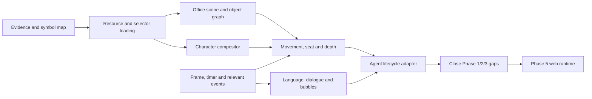

# แผน Selective Code Translation สำหรับ Virtual AI Office

สถานะ: **Wave 0 เสร็จแล้ว** — สร้าง translation index/coverage แล้ว; ยังไม่ได้แปลหรือ port logic

## ข้อสรุป

ควรทำ code translation ก่อนเดิน Phase 1/2/3/5 ต่อ แต่ไม่ควรแปล C ทั้งเกมและไม่ควรแปลเป็น prose อย่างเดียว เป้าหมายคือสร้าง “ชุดความรู้พร้อมใช้” ที่เชื่อมตั้งแต่ source/init ไปจนถึงผลที่ runtime ต้องใช้ โดยทุกข้อสรุปย้อนกลับไปหา `dump.cs`, recovered C, assembly fallback, resource list และ asset จริงได้

Phase 4 เดิมจึงควรถูกยกมาทำเป็น foundation track ตอนนี้ แล้วนำผลกลับไปปิด unknown ที่ block Phase 1/2/3 ก่อนเริ่ม minimal web runtime

## เหตุผลจาก repository ปัจจุบัน

- `GameForm` เป็น monolith ที่เก็บ scene, human, employee, furniture, dialogue, time และ event state ไว้ใน static arrays ชุดเดียว การศึกษาเฉพาะ `DrawHuman` หรือ asset กลุ่มใดกลุ่มหนึ่งจึงเห็นเพียงปลายทาง
- recovered `form_GameForm__MainProcess` ยาวประมาณ 15,354 บรรทัด, `_draw` 4,554 บรรทัด, `NextPoint` 2,404 บรรทัด และ `DrawObj` 1,770 บรรทัด จึงต้องแยก branch ตาม data flow ไม่ใช่แปลทั้ง function เป็นก้อนเดียว
- `NewGamePara` และ `DoEvent` เป็นสอง function ใหญ่ที่ C decompile ไม่สำเร็จและมี assembly fallback 13,671 กับ 15,569 instructions ตามลำดับ ทั้งสองก้อนมีแนวโน้มเป็น initializer/event bridge ที่ระบบอื่นพึ่งทางอ้อม
- `game/img.inf` ไม่เรียงตามเลขท้าย filename เช่น `body10.png` มาก่อน `body2.png` ดังนั้นห้ามถือว่า selector index เท่ากับเลขในชื่อไฟล์จนกว่าจะ trace loader/initializer
- `DrawHuman` มี 106 callsites และ 92 จุดใช้ selector แบบ variable-driven; body/face composition ถูกยืนยันแล้ว แต่ selector provenance และ semantic state ยังขาด
- state ของ actor กระจายอยู่ใน `Human*`, `Objec*`, `Target*`, `Desk*`, `Chair*`, `Syain*`, `Fuki*`, `Kaiwa*` และ event queue จึงต้องแปลครบหนึ่งเส้นทาง `initialize -> update -> transition -> draw -> text/event`

## ความหมายของคำว่า “แปลเสร็จ”

หนึ่ง translation unit จะถือว่าเสร็จต่อเมื่อมีครบ:

1. source identity: class/function, RVA, source file และระบุว่าเป็น C หรือ assembly
2. signature และความหมาย argument/return ที่พิสูจน์ได้
3. field/constant ที่อ่านและเขียน โดยแทน raw offset ด้วยชื่อจาก `dump.cs`
4. callers, callees และ dependency ทางอ้อม
5. branch/state-transition table
6. asset, resource index, text tag/ID และ timer ที่เกี่ยวข้อง
7. neutral pseudocode ที่ไม่ใส่ semantic จากการเดา
8. input/output fixture หรือ deterministic test ที่ตรวจ contract ได้
9. confidence (`verified`, `probable`, `unknown`) พร้อม evidence
10. แยก `legacy_fact` ออกจาก `web_adapter_decision` อย่างชัดเจน

การมี Markdown อธิบาย function แต่ไม่มี field map, fixture หรือ dependency trace ยังไม่ถือว่าแปลเสร็จ

## Dependency map



## ขอบเขตที่ต้องแปล

### A. Evidence และ symbol restoration — ต้องทำก่อนทุกหมวด

เป้าหมายคือทำให้ recovered C/assembly อ่านเป็นชื่อระบบได้ ไม่ใช่ raw offsets และ anonymous calls

ต้องจัดทำ:

- GameForm/AppData field-offset dictionary จาก `dump.cs`
- function inventory จาก `script.json`, RVA และ categorized/recovered C
- call graph เฉพาะ office runtime
- string-literal resolver จาก pointer/symbol ไปข้อความจริง
- static-array/default-data provenance รวม private implementation blobs ที่ใช้ initialize tables
- coverage matrix ว่า function ใดมี C, recovered C, assembly-only หรือยังขาด

ก้อนนี้ต้องมาก่อน เพราะ `MainProcess`, `NewGamePara` และ `DoEvent` จะอ่านผิดง่ายมากถ้ายังเห็นเพียง `+0xe78`, `+0xf40` หรือ branch address

### B. Resource และ asset-selector pipeline — ต้องแปลเต็มเส้นทาง

ขอบเขตหลัก:

- `AppData.Init`, `AppData.GetImage`
- `ResourceManager.Load*`, `GetImage`, `LoadImage`, `LoadSeb`
- `JarInflater` เฉพาะ file lookup/extension/resource-order contract
- `Seb._load`, sprite record, frame/layer/depth และ draw contract
- `GameForm..cctor`, `LoadBihinImage`, `EventGChange`
- slice ที่เกี่ยวกับการ populate `imgBody[]`, `imgFace[]`, `imgHuman[]`, floor/event/furniture images ใน `NewGamePara`
- `IMG_LIST`, `img.inf`, `seb.inf`, `DDBody`, `DDFace`, `DDFloor`, `DDDesk`, `DDChair` และ index-to-filename mapping

ผลที่ต้องได้:

- selector index -> resource-list index -> filename -> hash/dimensions
- แยก `selector_index`, `resource_index`, `filename_numeric_id` เป็นคนละ field
- loader fixture ที่ยืนยัน body, face, floor, desk, chair และ reception อย่างน้อยหนึ่งตัวต่อ family

ก้อนนี้เป็น blocker แรกของ Phase 2 และเป็นฐานของ Phase 1

### C. Render loop, coordinate และ camera contract — แปลเฉพาะ visual runtime

ขอบเขตหลัก:

- `GameForm.Init`, `GameScreenLayout`, `RenderGameScreen`
- `Update`, `_update`, `Draw`, `_draw`, `SmartBeginPaint` เฉพาะ frame/draw orchestration
- `SetScale`, `GetGameWidth`, `GetGameHeight`
- `Graphics.DrawImage`, origin/clip/scale เฉพาะ behavior ที่ GameForm ใช้
- camera/world/screen coordinate ที่ใช้โดย `DrawFloorCover`, `DrawObj` และ actor

`OnTouchCamera` และ pinch/touch behavior เป็น conditional: แปลเมื่อเลือกให้เว็บเลียนแบบ pan/zoom เดิม; ถ้าเว็บใช้ input ใหม่ ให้เก็บเพียง coordinate transform contract

### D. Office scene, furniture, placement และ depth — ต้องแปลเต็มเส้นทาง

ขอบเขตหลัก:

- `CallHikkosi`, `AddObjec`, `AddTarget`
- `CallPCChange`, `CallDeskChange`, `CallChairChange`
- `GetPcImgData`, `GetDeskImgData`, `GetChairImgData`
- `DrawFloorCover`, `DrawObj`, `DrawDesk`, `DrawCeoDesk`, `DrawDisplay`, `DrawChair`, `DrawReception`
- `Objec*`, `Target*`, `OfficeObjecList`, `DeskZahyou`, `DeskObjec`, `ChairMainObjec`, `ChairSubObjec`, `PCObjec`
- sort key และ draw-dispatch branches ใน `DrawObj`

ผลที่ต้องได้:

- object record schema ที่ตั้งชื่อทุก field ได้เท่าที่มีหลักฐาน
- room initialization -> object list -> screen position -> draw order trace
- desk/chair/PC relation และ seat/interaction candidate
- ระบุ collision/walkability ว่าเป็น legacy fact หรือ web-only adapter decision

### E. Character composition และ employee binding — ต้องแปลเต็มเส้นทาง

ขอบเขตหลัก:

- `AddBodyFace`, `DrawHuman` ทั้ง overload หลักและ forwarding overload
- BodyFace table initialization/provenance ใน `NewGamePara` หรือ callsites ที่เกี่ยวข้อง
- `AddSyain`, `CallSyain`
- `SyainFaceG`, `SyainBodyG`, `SyainHuman`, `HumanFaceG`, `HumanBodyG`, `HumanObjec`
- shadow/`TKage`, mode-specific offset และ branch ของ compositor

ผลที่ต้องได้:

- character definition -> employee -> human actor -> object -> DrawHuman selectors
- exact body/face resource mapping หรือ unknown ที่มีเหตุผลและทางปิดชัดเจน
- compositor fixture ที่เทียบ crop/destination กับ recovered C

### F. Movement, animation, seat และ actor state machine — ต้องแปลเต็มเส้นทาง แต่ slice `MainProcess`

ขอบเขตหลัก:

- `NextTarget`, `NextPoint`, `Atan2`, `Distan`
- Human state arrays: `HumanMode`, `HumanState`, `HumanTime`, `HumanStop`, `HumanWalkLong`, `HumanSitChair`, `HumanReaction`, `HumanWait`, `HumanNowPoint`, `HumanGoalPoint`, `HumanX/Y`, `HumanPX/PY`, `HumanDegree`, `HumanAnime`, `WalkAnime`
- `ObjecAnime`, `KeyAnimeT`, `FormTime` และ timer ที่กระทบ actor
- branch ใน `MainProcess` ที่อ่าน/เขียน Human/Objec/Target/Syain/Fuki arrays
- HumanDex เฉพาะที่ช่วยพิสูจน์ selector/timer/direction ไม่ใช้เป็น office runtime โดยอัตโนมัติ

ผลที่ต้องได้:

- state transition table แบบ neutral (`legacy_mode_n`) ก่อน map เป็น idle/walking/working/sitting/break/talking
- target selection, movement step, arrival behavior, chair/desk binding และ animation selector expression
- timing/loop/direction evidence
- end-to-end trace ของ employee อย่างน้อยหนึ่งตัวตั้งแต่ spawn จนถึง draw

### G. Bubble, dialogue และ language — ต้องแปลเฉพาะข้อความที่ office runtime ใช้

ขอบเขตหลัก:

- `AddFuki`, `CallFuki`, `DrawFukidashi`
- `AddKaiwaTalkData`, `GetTalkIndex`, `GetHumanTalkName`, `AddKaiwa`, `ResetTextLayout`
- `AppData.GetTalkTexts`
- `Language.SetTextTable`, `MakeTextTable`, `TranslateText`, `_translateText`, `_translateText2`, `LT` และ locale/fallback contract ที่จำเป็น
- `TextLayout` เฉพาะ placeholder/tag/line-layout behavior ที่ bubble ใช้
- CSV ID, dialogue tag, source text และ placeholder ต้องถูกแยกเป็นคนละ identifier

ผลที่ต้องได้:

- `talk tag -> talk index -> source text -> locale entry -> formatted bubble` trace
- placeholder/token grammar และ QA fixtures
- locale fallback ที่ไม่พึ่งภาษาอังกฤษซึ่งไม่มีใน extracted language folder
- catalog เฉพาะ chat/status/task/notification; ไม่แปลข้อความ gameplay ทั้งหมด

### H. Time, event และ lifecycle bridge — แปลเฉพาะ branch ที่พัวพันกับ Agent state

ขอบเขตหลัก:

- update cadence จาก `Update -> _update -> MainProcess`
- `AddEvent` และ event queue fields
- slice จาก assembly-only `DoEvent` ที่สร้าง/เปลี่ยน human, dialogue, bubble, office object หรือ employee lifecycle
- `AddMessage` และ notification path เฉพาะส่วนที่นำมาใช้กับ dashboard ได้
- การเชื่อม employee working/resting/talking/request/meeting กับ visual state

ห้ามแปล `DoEvent` ทั้ง 62 KB เป็นก้อนเดียว ให้สร้าง branch index ก่อน แล้วแปลเฉพาะ event modes ที่แตะระบบใน scope

## ขอบเขตที่แปลแบบ contract-only

ส่วนเหล่านี้ต้องรู้พฤติกรรมที่ caller พึ่ง แต่ไม่ต้อง port implementation ภายใน:

- `Graphics`, `Image`, `Offscreen`, `GameView` เฉพาะ draw/clip/origin/scale/surface size
- `ResourceManager` และ `JarInflater` ส่วน generic async/cache/dispose ที่ไม่เปลี่ยน resource order
- `TextLayout` ส่วน font/ruby/cache ที่ไม่กระทบ token และ bubble layout
- random/math utility ทั่วไป
- form/touch infrastructure ที่ไม่เกี่ยวกับ camera หรือ office interaction

ผลลัพธ์เป็น interface contract + test expectation ไม่ใช่การแปล framework ทั้ง library

## ขอบเขต conditional

แปลเมื่อ feature ของเว็บเลือกใช้จริง:

- original pan/zoom/touch behavior
- visitor/reception actor lifecycle
- visual emote/ball/reaction (`CallBallEnd`, `CallNouryoku`)
- sound cue และ ambience
- original save/load เฉพาะกรณีต้อง import layout/save เดิม
- original message/event presentation นอก bubble

หากไม่เลือกใช้ ให้เขียน `web_adapter_decision` และปิดรายการ ไม่ปล่อยเป็น unknown ลอย ๆ

## ขอบเขตที่ตัดออก

- game development simulation, genre/content/platform/research
- เงิน ยอดขาย ranking magazine/news progression และ win/lose
- hiring/education/item/economy logic ยกเว้น field appearance/speed ที่จำเป็นต่อ actor definition
- store, billing, ads, social, ranking server, HTTP และ platform services
- full save migration และ leaderboard
- full audio engine
- generic Unity/.NET internals
- full language-pack authoring, translation cache, Hindi/Chanakya conversion และ tooling ที่ไม่อยู่ใน runtime locale path
- full `NewGamePara`, `MainProcess`, `_draw`, `DoEvent` และ `SubForm` translation; ใช้วิธี branch/slice ตาม dependency เท่านั้น

## ลำดับทำงาน

### Wave 0 — Translation index และ vocabulary

สร้าง field map, function inventory, call graph, string resolver, assembly call-target resolver และ coverage matrix ก่อน

ผลที่สร้างแล้วอยู่ใน `Phases/Phase4/artifacts/` และตรวจด้วย
`Phases/Phase4/tests/test_wave0_index.py` (ผ่าน 6/6 tests): shortlist 88 units,
categorized C 83, assembly fallback 2, dump/script-only 3; `GameForm` field map
มี 1,850 fields จาก 12 classes และ string table 12,647 entries. `StringLiteral_12647`
ถูกบันทึกเป็น terminal sentinel นอกช่วง zero-based table ไม่ถูกนับเป็น missing literal.

Gate ผ่าน:

- raw field offset ที่อยู่ใน shortlist resolve เป็นชื่อหรือมีสถานะ unknown พร้อม owner
- ทุก function ใน shortlist มี source/RVA/status
- รู้ว่า branch ใดอยู่ใน C และ branch ใดต้องใช้ assembly

### Wave 1 — Resource truth

แปล resource pipeline และ initializer slice เพื่อปิด selector-to-file mapping รวม SEB variant/tail behavior ที่ runtime ใช้จริง

Gate ผ่าน:

- body/face/floor/furniture selector มี mapping ที่ตรวจด้วย fixture
- แยก resource-list order ออกจาก filename numbering
- asset ที่ Phase 1/2 ใช้ทุกตัวมี provenance

### Wave 2 — Office scene truth

แปล room/object initialization, furniture relations, coordinate transform และ depth ordering

Gate ผ่าน:

- สร้างหนึ่ง office layout จาก translated records ได้
- object dispatch และ draw order เทียบกับ code ได้
- placement/seat/depth ทุก field ถูก resolve หรือประกาศเป็น adapter decision

### Wave 3 — Actor truth

แปล character composition, employee binding, target/movement และ actor state/timer branches

Gate ผ่าน:

- actor หนึ่งตัวเดิน/ถึงเป้าหมาย/วาดได้จาก translated contract
- mode sequence และ timer มาจาก code ไม่ใช่การเรียงภาพ
- Phase 2 agent-state mapping ถูก update จาก evidence ใหม่

### Wave 4 — Conversation truth

แปล bubble/dialogue/language pipeline และทำ locale/placeholder fixtures

Gate ผ่าน:

- tag/ID/text/locale/fallback เชื่อมครบ
- bubble หนึ่งเส้นทาง render ข้อความที่ format แล้วได้
- Phase 3 runtime schema ไม่ต้องเดา lookup behavior

### Wave 5 — Lifecycle bridge

แปลเฉพาะ MainProcess/DoEvent branches ที่เชื่อม visual actor กับ working, break, talking, request และ meeting-like behavior

Gate ผ่าน:

- legacy transition แต่ละตัวมี trigger, state mutation, visual selector และ exit condition
- map ไป Agent state ได้แบบ `verified`/`probable` หรือประกาศ web-native behavior
- ไม่มี gameplay side effect ถูกพอร์ตเพียงเพราะอยู่ branch เดียวกัน

### Wave 6 — Closure sweep และ handoff ไป Phase 5

นำ translated contracts ไป regenerate/ปรับ Phase 1/2/3 artifacts และสร้าง minimal runtime spec

Gate ผ่าน:

- unknown ทุกตัวที่ Phase 5 ต้องใช้ถูกจัดเป็น `resolved`, `web_adapter_decision` หรือ `out_of_scope`
- Phase 1 room manifest, Phase 2 animation/state manifest และ Phase 3 language manifest อ้าง translation artifacts ชุดเดียวกัน
- มี golden fixture อย่างน้อยหนึ่งเส้นทาง: load room -> spawn agent -> move -> draw -> bubble
- Phase 5 ไม่ต้องย้อนกลับไปอ่าน raw C เพื่อทำ feature ขั้นพื้นฐาน

## Artifacts ที่ควรสร้างเมื่อเริ่มแปล

```text
Phases/Phase4/
  artifacts/
    function_inventory.json
    field_offset_map.json
    string_literal_map.json
    office_runtime_call_graph.json
    translation_coverage.json
    resource_selector_map.json
    scene_contract.json
    actor_state_contract.json
    dialogue_language_contract.json
    fixtures/
  docs/
    runtime_architecture.md
    resource_loading.md
    office_scene_and_depth.md
    character_composition.md
    movement_and_state_machine.md
    dialogue_and_language.md
    event_lifecycle_bridge.md
    legacy_to_agent_mapping.md
  references/
    pseudocode/
  tools/
  tests/
```

ไฟล์ pseudocode เป็น neutral reference ไม่ใช่ production web code และต้องเก็บ source citations/line references ไว้เสมอ

## วิธีไม่ให้แปลแล้วตกหล่นอีก

ใช้ dependency closure ต่อ translation unit:

1. เริ่มจาก output ที่ runtime ต้องได้
2. trace ผู้ผลิตข้อมูลย้อนกลับจนถึง initializer/resource/text source
3. trace ผู้บริโภคไปข้างหน้าจนถึง draw/event output
4. เพิ่ม dependency ที่พบเข้า shortlist
5. หยุดเมื่อ dependency ถูกจัดเป็น translated, contract-only, adapter decision หรือ out-of-scope

ห้ามปิด unit หากยังมี dependency สถานะ “เจอแล้วแต่ยังไม่ได้จัดประเภท” วิธีนี้ทำให้สิ่งเล็ก ๆ เช่น resource order, timer, seat offset หรือ placeholder ไม่หลุดไปค้างปลาย phase

## จุดเริ่มหลังอนุมัติแผน

เริ่ม Wave 0 ก่อน โดยยังไม่แก้ source roots และยังไม่ port เว็บ จากนั้นทำ Wave 1 เพื่อปิด `imgBody[]`/`imgFace[]` mapping และ initializer provenance ซึ่งเป็น dependency ที่คุ้มค่าที่สุดสำหรับทั้ง Phase 1 และ Phase 2
