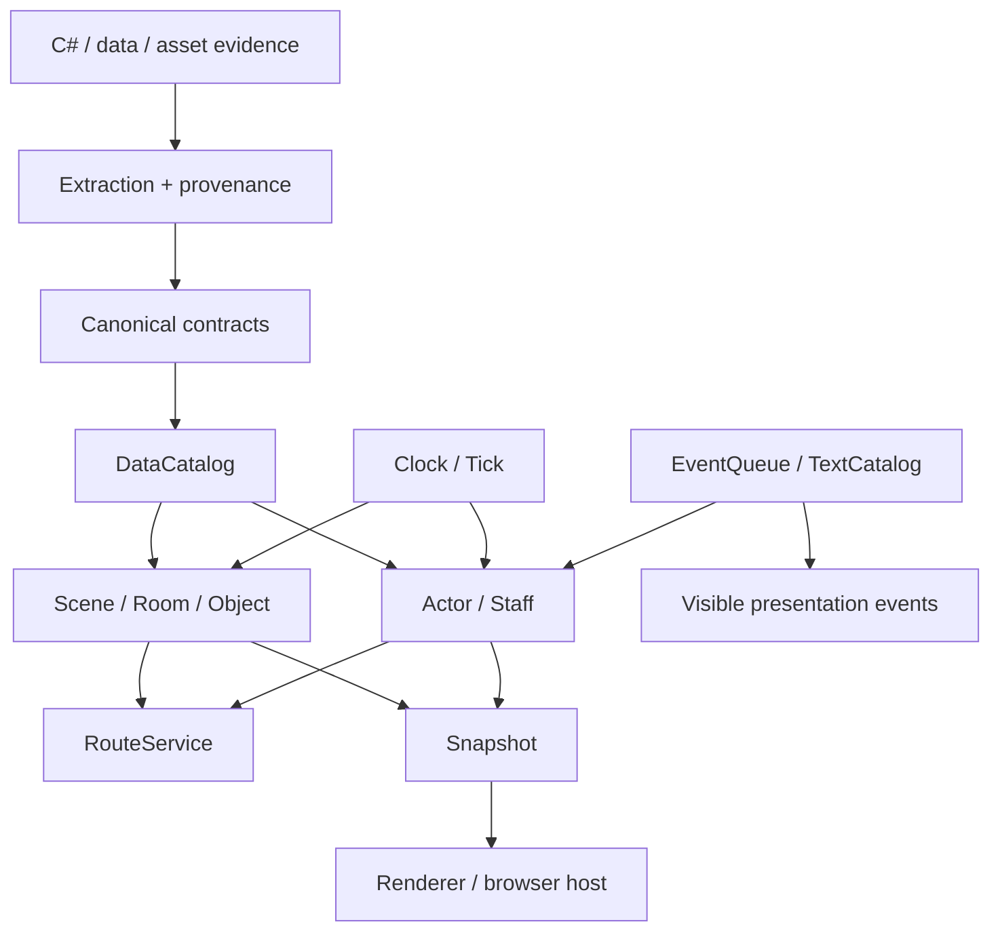

# Social Dev — C# System Survey

## Summary

The initial Social Dev task is to extract C# systems into data and contracts before writing a new runtime. It is not to copy C# or start with the renderer.

The current inventory contains C# update `82` types, `3,430` fields, and `1,685` methods. `DataManager` has `43` typed-array registries covering `44` data classes and `1,112` fields. These numbers describe the evidence boundary, not the amount of code to port.

Important evidence:

- `DataManager.Load()` contains many IL/decompiler artifacts, so it is evidence for load order and registry names, but its body must not be copied.
- `AppData` and `Player` combine multiple layers of responsibility and must be split into context, clock, world, and presentation responsibilities.
- `Room.Update()` shows the main dependency order: the room updates `Staff` before `ObjChip` and has separate planning/bubble passes.
- `Staff` has clear state and movement modes at the center of the living logic.
- `ObjChip` represents world objects, passability/occupancy, and interaction, not just a drawing layer.
- `Astar` is a route service tied to the room grid and desk/equipment/staff goal flags.
- `Main` owns application lifecycle (`OnCreate`, `OnUpdate`, `OnDraw`, suspend/destroy) and should become a browser-host adapter rather than core gameplay.

Primary survey references:

- Structural catalog: `knowledge/fixtures/accepted/csharp_update_inventory/type_catalog.json`, `field_catalog.json`, `method_catalog.json`.
- Raw/update source anchors: `sources/raw/1_Click_CSharp_Code update/` and `knowledge/sources/csharp_raw_20260813/`.
- Data/load candidates: `docs/reports/social-dev_data_schema_candidate.md`, `social-dev_load_contract_candidates.md`, `social-dev_field_load_candidates.md`.

## Systems to rewrite

`P0` means required for the scene and office life to work. `P1` means required when visible behavior must become game-faithful. `P2` means optional systems that should not enter the first round.

| New system | C# evidence | Responsibility to preserve | Rewrite scope |
|---|---|---|---|
| `DataCatalog` | `DataManager`, data classes | Typed record loading, stable IDs, text/selector/data lookup | P0 — write a new loader from extracted tables; do not port `DataManager.Load()` |
| `WorldContext` | parts of `Main`, `AppData`, `Player` | Clock, room list, actors, route service, event queue, and snapshot ownership | P0 — split from both god objects |
| `Scene/Room` | `Room`, `RoomData`, `MapChip`, `Camera` | Floor/grid, map layer, object placement, coordinate transform, draw order | P0 — preserve verified scene data and update/draw order |
| `Object/Occupancy` | `ObjChip`, `FurnitureData` | Footprint, direction, passability, occupied/user state, interaction point | P0 — combine visible collision and interaction |
| `Actor/Staff` | `Staff`, `StaffData`, `JobData`, `SkillData` | Spawn, position, state, movement, work, talk, bubble, animation | P0 — write a new state machine from extracted states/modes |
| `RouteService` | `Astar`, `Node`, `Room` | Grid creation, neighbor connection, routing to desk/equipment/staff | P0 — implement A* from the contract and fixtures |
| `Clock/Tick` | `Player` (`UpdateCurrentTime`, `RealTimeProcess`, `UpdateRealTimeData`, `Update`, `Frame`) | Logical time, frames, timers, and update order | P0 — deterministic tick; wall clock is an external adapter |
| `Interaction` | `Staff`, `ObjChip`, `ScheduleData` | Sit, use equipment, talk, work, finish action | P1 — only actions visible in the scene |
| `EventQueue` | `DelayEvent`, `EventData`, `AvatarEventData` | Delayed event, term checks, visible talk/subform/bubble | P1 — start with opcodes/terms that affect visuals/text |
| `TextCatalog` | `TalkData`, `AvatarTalkData`, `EventMessageData`, `TodayEventData` | Speaker, text, newline/tab normalization, notification/bubble | P1 — stable key + locale/fallback + provenance |
| `PresentationAdapter` | `Staff.Draw*`, `ObjChip.Draw*`, `Room.Draw`, `Camera`, `Main.OnDraw` | Convert snapshots into sprites/layers/bubbles/viewport | P1 — build after the state contract; UI must not compute state |
| `Avatar` | `Avatar`, avatar event/talk data | Avatar/profile/event actor | P2 — add when the first scene has real avatar interaction |
| `Meeting` | `Meeting`, meeting-related data | Meeting sequence and visual meeting behavior | P2 — separate feature after the first office loop passes |
| management/gameplay | `Proposal`, `Develop`, `Company`, `GameRecord`, `Fan`, `Enemy`, `FestivalManager`, etc. | Economy, progression, development battle, backend-like management | Cut/defer — outside the first display/living core |

## Dependency backbone



This dependency means `Staff` does not read data files itself, the renderer does not call `Player` to mutate state, and `DataCatalog` does not know about DOM/canvas. All layers communicate through shared contracts and snapshots.

## What to extract from C# before writing each system

### 1. Structural system map

Create one entry per type/method/field/constant with `source_ref`, line, input/output type, and evidence status:

- `verified` — declaration and behavior/consumer evidence agree;
- `raw_only` — visible in C# but semantic meaning is not known;
- `derived` — calculated or regrouped, with reason and input hash;
- `unknown` / `conflict` / `quarantine` — must not silently enter runtime.

The first round must complete dependency notes for `Main → AppData/Player → Room → Staff/ObjChip → Astar` and `DataManager → data records` before assigning owner and consumer roles.

### 2. Data tables and loader contract

Extract `DataManager` and data classes into stable-ID records instead of relying only on array indices, starting with the display-slice data:

`RoomData`, `FurnitureData`, `StaffData`, `JobData`, `SkillData`, `TalkData`, `EventData`, `AvatarEventData`, `ScheduleData`, `TodayEventData`

For each set, retain:

- table/file name and language;
- column count/type and observed reader order;
- matched field declarations;
- default/new-game behavior;
- count mismatch or missing loader;
- source hash and evidence references.

If a column cannot be matched to a field, keep it `raw_only` and add it to the review queue; do not infer meaning from column position.

### 3. Scene/object extraction

Extract enough data to create a room without depending on the C# runtime:

- room/floor identity, width/height, and map grid;
- floor/wall/door/object selectors;
- object position, direction, footprint, and passability;
- staff spawn/desk/equipment relationships;
- camera base position, target, clamp, and coordinate transform;
- layer/draw order.

`MapChip` is a relatively separate visual-tile layer. `ObjChip` must be extracted for both visuals and occupancy because it contains `IsPassable`, standing positions, user/reservation, and action lifecycle.

### 4. Actor/living extraction

Record `Staff` as a behavior contract rather than copying all 227 fields:

- observed states: `NORMAL`, `MEETING`, `MOVE`, `SIT_DOWN`, `WORK`, `USE_EQUIPMENT`, `TALK`, `INVITE_TO_TALK`, `WAIT`, `WANDER`, `WAIT_BACK_OF_DOOR`, `DEVELOP`, `STAY_HOME`;
- movement modes: equipment, desk, staff, talk-standing point, door, home, and wander;
- state entry/exit, timer, route input, arrival callback, and visible output;
- facing/animation frame, typing, fukidashi/bubble, and alpha/scale;
- relationships to `Room`, `ObjChip`, `Astar`, and `StaffData`.

For the first round, cut development-battle and management states and retain a visible loop such as `idle → move → sit/work → talk → idle`.

### 5. Route/collision extraction

Build fixtures from `Astar` and `Room/ObjChip` that can check at least:

- grid coordinate ↔ room/object index;
- neighbor connection and diagonal policy;
- blocked/passable cell;
- desk/equipment/staff goal flags;
- found routes, failed routes, and routes around obstacles.

Because the `Astar` body has many decompiler artifacts, use declarations, room dimensions, goal flags, and consumer behavior as the contract, then implement the algorithm anew. Do not assume the current body is compilable.

### 6. Event/text extraction

Start with events that affect display:

- talk, delay, event message, news/notification, and bubble;
- time/login/rank/event terms only when they make text appear;
- scripts/opcodes that create visible output;
- speaker/character index and text normalization.

Do not bring every `EV_*` related to shop, coin, publish, recruitment, or progression into the runtime feature set yet.

### 7. Asset-selector extraction

Connect selectors from `MapChip`, `ObjChip`, `Staff`, `Avatar`, and `AppData` to the asset index/APK/ZIP through verifiable relationships. Do not guess from filenames or paths. Structural asset consistency has passed, but selector promotion remains blocked, so these values stay in evidence until the selector gate passes.

## Rewrite approach

### Selected form

Use a **behavior-faithful, contract-first rewrite**:

- use C# as authority for system names, states, field relationships, method roles, and verified ordering;
- write a new implementation as small Social Dev runtime modules;
- preserve visible behavior and deterministic tick order close to the original game;
- do not preserve object layout, singleton, save format, or old UI API unless required by the output;
- do not use `VGO_Core` or import runtime from the legacy archive.

This is neither an imaginative rewrite of formulas nor a pasted C# port. It is a new implementation of **evidence-backed semantic contracts**.

### Runtime modules to create later

```text
runtime/social-dev/
  evidence/       # approved contracts and validation reports
  catalog/        # normalized scene/actor/object/text data
  core/
    world-context
    clock
    room
    object-occupancy
    staff-state-machine
    route-service
    event-queue
    snapshot
  render/         # snapshot → canvas/DOM/sprite layers
  host/           # browser lifecycle, input, asset resolver
```

`catalog` loads only gated data, `core` changes state deterministically, and `render` reads snapshots only.

## Actual work order

### Phase A — System extraction (first task)

1. Build the system inventory and dependency map from the real catalog/source.
2. Classify types/methods/fields as `keep`, `adapt`, `defer`, or `cut`.
3. Write extraction notes for 9 data types and 6 core systems: `DataManager`, `Room`, `Staff`, `ObjChip`, `Astar`, and the `Player/AppData` subset.
4. Close unknowns blocking the display slice without attempting to explain the whole game.

Result: system survey, dependency graph, source-slice manifest, and review queue.

### Phase B — Normalized data package

1. Extract tables/data/selectors/constants/transitions as intermediate evidence.
2. Fix loader mismatches only for data in the slice.
3. Build canonical `SceneCatalog`, `ActorCatalog`, `ObjectCatalog`, `TextCatalog`, and `BehaviorCatalog`.
4. Build fixtures that load and trace every record back to source.

Result: usable data without reading decompiled C# in the browser.

### Phase C — Core rewrite before renderer

Implementation order:

1. `DataCatalog` + schema validator;
2. `Clock` + deterministic tick;
3. `Room`/grid + `ObjectOccupancy`;
4. `RouteService`;
5. `StaffStateMachine` + movement/work/talk;
6. `EventQueue` + text/bubble;
7. snapshot/digest/replay fixture.

Each step must have a passing test/trace before the next step starts.

### Phase D — Display adapter

Connect `Camera`, map/object/character animation, layer order, bubble, and viewport to the snapshot only after the core can replay; then compare screenshots with the game.

### Phase E — Scope expansion

Add avatar, meeting, special event, or management only when a visible requirement and data/behavior contract support it. Do not expand merely because a class exists in C#.

## Gate: “data ready for implementation”

Each system is ready to rewrite when:

- owner/consumer and dependencies are clear;
- fields read by runtime have status and source references;
- loader/column mapping has evidence or an explicit exception;
- state transitions and tick order have a replayable fixture;
- scene/object/actor selectors resolve without guessed paths;
- there is no import from raw C#, `VGO_Core`, or legacy runtime;
- unresolved items are separated as `unknown`/`quarantine` rather than hidden by defaults.

## Next work

1. Build the machine-readable system inventory from the current catalog.
2. Build the field/behavior matrix for the `Room`, `Staff`, `ObjChip`, `Astar`, `Camera`, and `Player` subset.
3. Select one display-slice room and 3–5 actors as the extraction target.
4. Extract the first `RoomData/FurnitureData/StaffData/JobData/SkillData/TalkData/EventData` set.
5. Create contracts and fixtures before any runtime implementation.
