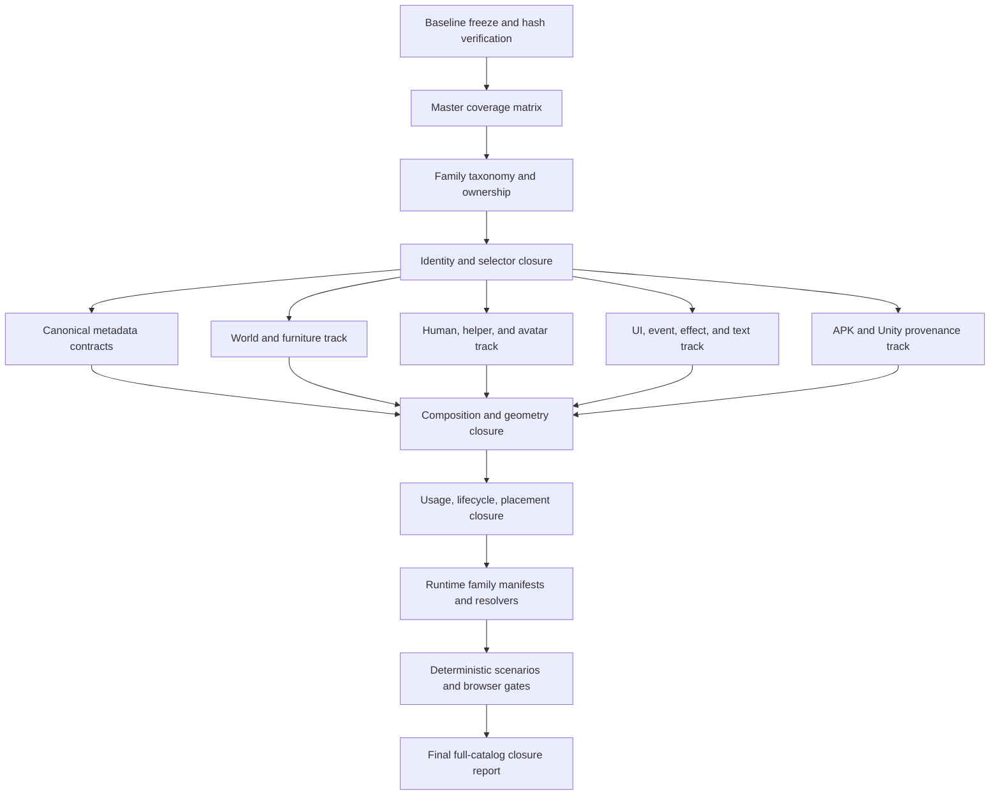

# Social Dev Asset Metadata Completion Roadmap

Status: Complete for the supplied package; runtime promotion remains family-scoped

Date: 2026-08-14

Scope: Complete the source-traceable asset metadata and runtime-readiness system
for the supplied Social Dev package without modifying the original source roots,
APK, asset ZIP, or decompiled C# evidence.

## 1. Objective

Build a complete, queryable asset metadata system in which every supplied asset
has an explicit answer for the levels that are supported by evidence:

1. What the asset is and which stable identity owns it.
2. Which native data record, selector field, or resource table points to it.
3. Which source file, archive member, APK entry, and hash prove the identity.
4. Which image, OPT, SEB, companion, or sub-composition records assemble it.
5. Which frame, crop, offset, anchor, layer, depth, direction, and coordinate rules apply.
6. Which consumer and lifecycle phase loads, places, updates, draws, or persists it.
7. Which scene, actor, event, UI state, or trigger can use it.
8. Whether the asset is runtime-approved, deferred, source-limited, quarantined, or unresolved.
9. Whether a deterministic test can resolve and reproduce the same result repeatedly.

The project must distinguish two outcomes:

- **Full catalog closure:** every supplied asset, selector, and asset-bearing data
  record is inventoried, namespaced, linked, and assigned an explicit status. A
  source-limited item may remain unavailable for runtime, but it may not remain
  unclassified.
- **Runtime readiness:** an asset is promoted only when its identity, composition,
  usage, placement, and validation requirements pass for the family that owns it.

The second outcome is stricter than the first. A complete catalog is not allowed
to claim that every binary is immediately renderable.

## 2. Current baseline

The following work is already closed and is the starting point for this roadmap:

| Boundary | Current evidence | Current meaning |
|---|---:|---|
| Asset index | `3,542` indexed source/derived assets | Supplied package is inventoried; this is not a count of visible game objects. |
| Native data | `43` DataManager arrays/types and `3,693` data rows | Native IDs, raw rows, locale rows, and provenance are retained. |
| Resource selectors | `3,192` `img.inf`/`seb.inf` selector records | `3,191` resolve; one `lineup_layout` `bg.seb` target remains explicitly unresolved. |
| Connection graph | `523` data-selector, `4,596` selector/asset, `250` consumer, and `43` lifecycle edges | A native identity and connection graph exists. |
| Rooms | `18` rooms and `1,800` raw 10x10 ObjChip cells | RoomData, MapChip separation, raw direction values, and room selector assets are closed. |
| Room assets | `23` exact selector PNGs: `10` floors, `7` walls, `6` doors | All-room floor/wall/door selector loading is closed. |
| Native assembly | `18/18` wall/door compositions, `4` direction values, `9` render passes | The bounded native room assembly contract is closed. |
| Character metadata | `141` StaffData, `19` HelperData, `30` JobData, `36` SkillData | Static character lookup is closed; mutable actor state remains separate. |
| Character capability | `4` family profiles, `141` staff bindings, `19` helper bindings, `35` human selectors | Shared action/direction lookup exists; full binary frame composition is not closed for every record. |
| Furniture metadata | `103` FurnitureData rows with selector fields and source provenance | Native selector identity is broad; complete visual composition and room placement are not. |
| Display subset | `18` approved gate entries and `34` promoted binary assets | Only a bounded subset is runtime-approved. |
| Browser closure | Rooms `0` through `17` pass the all-room assembly/browser gate | This validates the current scene contract, not every asset family. |

The authoritative current contracts are:

- `knowledge/fixtures/accepted/runtime/native_content_catalog.json`
- `knowledge/fixtures/accepted/runtime/native_scene_assembly_contract.json`
- `knowledge/fixtures/accepted/runtime/character_metadata_contract.json`
- `knowledge/fixtures/accepted/runtime/character_capability_contract.json`
- `knowledge/fixtures/accepted/runtime/room_catalog_contract.json`
- `knowledge/fixtures/accepted/runtime/room_scene_asset_manifest.json`
- `knowledge/fixtures/accepted/runtime/display_asset_manifest.json`

Historical evidence and the source package remain read-only inputs. The current
runtime imports approved contracts and promoted binaries, not APK files, archives,
or decompiled C#.

## 3. Readiness model

Every asset-bearing record must move through explicit states. The state is per
dimension; one asset may be selector-ready but composition-deferred.

| Dimension | Required result | Runtime consequence |
|---|---|---|
| `inventory` | Asset exists in the supplied package/index with a hash | Eligible for further analysis. |
| `identity` | Stable namespaced asset ID and source identity | May be queried by ID. |
| `selector` | Every native selector reference resolves, is an explicit `-1` sentinel, or has a reasoned unresolved status | May be connected to native data. |
| `semantic` | Family, role, and meaning are evidence-backed | May be used by a family resolver. |
| `composition` | PNG/OPT/SEB/layer/frame/crop relationship is verified | May be assembled without guessing. |
| `geometry` | Anchor, offset, crop, coordinate, footprint, and passability rules are verified | May be placed in a scene or UI. |
| `lifecycle` | Load, bootstrap, resolve, update, draw, and persist consumer is known | May be called at the correct phase. |
| `usage` | Trigger, action, event, screen, or scene consumer is known | May be selected by behavior or UI code. |
| `runtime` | Approved binary and versioned runtime contract exist | May be loaded by the browser/runtime. |
| `scenario` | Deterministic query/render/behavior test passes | May be treated as repeatably usable. |

Allowed terminal statuses are:

- `verified`
- `derived`
- `runtime_approved`
- `raw_only`
- `deferred`
- `source_limited_unresolved`
- `quarantine`
- `conflict`

`unknown` may remain in historical evidence, but every active coverage row must
convert it into one of the terminal statuses above with a provenance and review
note. No status may be silently upgraded because a filename looks plausible.

## 4. Canonical metadata target

The final metadata model should be a stable projection, not a copy of the C# or
Unity object layout. It should contain the following groups.

```text
AssetMetadataRecord
  identity
    asset_id
    family
    kind
    native_namespace
    native_ids
    selector_keys
    runtime_id
  provenance
    source_archive
    archive_member
    apk_source_entry
    source_file
    source_row
    source_hash
    derived_from
    input_hashes
  semantic
    role
    display_name_by_locale
    source_status
    confidence
    review_note
  selectors
    img
    seb
    sub_seb
    companion_selectors
    sentinel_values
  composition
    layers
    frame_count
    frame_bound
    frame_records
    source_rectangles
    logical_size
    runtime_asset
    composition_status
  geometry
    anchor
    destination_offset
    crop_offset
    footprint
    passability
    coordinate_system
    camera_policy
    direction_policy
    render_pass
    depth_policy
  usage
    consumer_methods
    lifecycle_phases
    load_trigger
    bootstrap_trigger
    update_trigger
    draw_trigger
    event_or_ui_trigger
    scene_bindings
    actor_bindings
  runtime
    runtime_path
    runtime_hash
    promotion_status
    lazy_load_policy
    fallback_policy
  validation
    contract_refs
    fixture_refs
    test_refs
    content_hash
    last_validated_at
```

The model must preserve raw values alongside translated labels. For example,
`ObjChip.direction_` must retain `0`, `1`, `2`, and `3` even when the contract
also exposes the verified native labels and vectors.

## 5. Global identity rules

These rules apply to every workstream:

1. Use namespaced IDs. A bare numeric `0` is never a globally unique identity.
   Use forms such as `data:furniture:0`, `data:staff:0`,
   `ref:human:seb:10`, `asset:01_GAME_PACKS/human/chara86.png`, and `room:0`.
2. Keep native data IDs, selector IDs, runtime instance IDs, and asset IDs separate.
3. Treat `-1` and other native sentinel values as explicit absence, not as a
   missing lookup to be guessed later.
4. Never infer FurnitureData identity from raw ObjChip type or occupancy.
5. Never infer a filename from a numeric selector without a selector-table edge.
6. Keep source, logical derived image, and physical runtime PNG as three distinct
   identities.
7. A consumer edge is not a composition proof. A selector target is not a draw
   contract. Each promotion requires the next evidence layer.
8. Keep source roots and archives read-only. New evidence belongs under
   `knowledge/fixtures/accepted`; runtime contracts belong under
   `knowledge/fixtures/accepted/runtime`; authored reports and roadmaps belong under
   `docs/`.

## 6. Dependency graph



The coverage matrix, taxonomy, and canonical schema are the shared prerequisites.
The four domain tracks may then proceed in parallel, but each track must follow
the same sequence: identity → composition → usage → placement → promotion →
scenario validation.

## 7. Work packages

### AM-0 — Freeze the current baseline

Priority: P0

Dependencies: none

Purpose: Make the current closed boundary reproducible before expanding it.

Tasks:

1. Run and record the current native registry/catalog, character metadata and
   capability, room catalog/asset, direction, native assembly, Phase 3D, and
   display asset gates.
2. Record source ZIP, APK, index, catalog, contract, and promoted-runtime hashes.
3. Record the current counts and known exceptions, including the `lineup_layout`
   unresolved `bg.seb` target, the room floor alias policy, and unbound furniture
   in rooms `1` through `17`.
4. Confirm that no source root, APK, asset ZIP, or historical baseline is modified.

Artifacts:

- `knowledge/fixtures/accepted/asset_metadata_baseline.json`
- `knowledge/fixtures/accepted/runtime/asset_metadata_baseline_contract.json`
- `docs/reports/social-dev_asset_metadata_baseline.md`
- `tools/social-dev/build_asset_metadata_baseline.py`
- `tools/social-dev/test_asset_metadata_baseline.py`

Exit criteria:

- All existing gates pass.
- Baseline counts and hashes are content-addressed.
- The new roadmap starts from a known green state.

### AM-1 — Build the master coverage matrix

Priority: P0

Dependencies: AM-0

Purpose: Prove that every supplied asset and every relevant native record is
accounted for before adding more semantic meaning.

Tasks:

1. Join the asset index, native content catalog, selector records, data-selector
   edges, asset companion edges, consumer edges, lifecycle edges, room manifests,
   character contracts, object contracts, and runtime display manifests.
2. Create one row per indexed asset and one related coverage row per selector and
   asset-bearing data field.
3. Record at least these coverage fields:

   - stable asset ID;
   - archive member and archive presence;
   - source/derived/catalog kind;
   - pack and family;
   - extension and physical dimensions;
   - source hash and APK source entry;
   - inbound data records and selector keys;
   - companion assets and derived assets;
   - consumer methods and lifecycle phases;
   - semantic, composition, geometry, usage, runtime, and scenario statuses;
   - explicit exception references.

4. Detect and report orphaned assets, orphaned selectors, data fields with a
   numeric selector but no edge, duplicate IDs, duplicate selector keys, missing
   archive members, and assets present only in derived browse catalogs.
5. Separate visual assets, metadata files, preview/contact-sheet artifacts,
   Android resources, and plain TextAsset payloads so the final report does not
   inflate visible-object counts.

Artifacts:

- `knowledge/fixtures/accepted/asset_metadata_coverage.json`
- `knowledge/fixtures/accepted/runtime/asset_metadata_coverage_contract.json`
- `knowledge/fixtures/accepted/asset_metadata_orphan_report.json`
- `docs/reports/social-dev_asset_metadata_coverage.md`
- `tools/social-dev/build_asset_metadata_coverage.py`
- `tools/social-dev/test_asset_metadata_coverage.py`

Exit criteria:

- All `3,542` indexed assets have a coverage row.
- All `3,192` selectors have a coverage row and an explicit status.
- All `3,693` data records have a coverage relation or an explicit
  `not_asset_bearing` disposition.
- No duplicate IDs or missing archive members are introduced.
- Every orphan is either resolved or assigned a named exception.

### AM-2 — Establish family taxonomy and ownership

Priority: P0

Dependencies: AM-1

Purpose: Prevent a single generic asset status from hiding family-specific needs.

Initial family taxonomy:

| Family | Primary scope | Initial owner contract |
|---|---|---|
| `world_scene` | MapChip, floors, walls, doors, outdoor chips, room selectors | Room catalog and native scene assembly |
| `furniture_object` | FurnitureData, equipment, furniture SEB/IMG/OPT, footprint/passability | Object catalog and furniture composition |
| `human_staff` | StaffData, human PNG/SEB, movement/wait/typing/talk | Character metadata and capability |
| `helper_record` | HelperData portraits, dialogue, effects, helper-specific assets | Helper profile |
| `avatar` | Avatar body/head parts and avatar composition | Reserved avatar profile |
| `event_effect` | Event, meeting, award, effect, animation, world-event visuals | Event/effect contracts |
| `ui_common` | Common UI, window, title, load, billing, mail, friend, lineup, recruit | UI family contracts |
| `content_text` | English/Japanese tables, strings, TextAsset payloads, text-linked graphics | Locale/content contracts |
| `platform_misc` | Android resources, connection/system payloads, browse catalogs | Non-game or deferred boundary |

Tasks:

1. Assign every named pack and ungrouped asset to exactly one primary family and
   optional secondary roles.
2. Assign every asset-bearing DataManager type to a family owner.
3. Assign known C# consumers and lifecycle phases to the owner contract.
4. Record whether the family is visual, data-only, companion-only, or platform-only.
5. Create a family-specific required-field matrix so that a furniture record is
   not judged by UI requirements and a UI icon is not judged by room footprint.

Artifacts:

- `knowledge/fixtures/accepted/asset_family_taxonomy.json`
- `knowledge/fixtures/accepted/runtime/asset_family_taxonomy_contract.json`
- `docs/reports/social-dev_asset_family_taxonomy.md`
- `tools/social-dev/build_asset_family_taxonomy.py`
- `tools/social-dev/test_asset_family_taxonomy.py`

Exit criteria:

- Every asset has a family or an explicit `platform_misc`/`deferred` disposition.
- Every family has an owner, required metadata fields, and a promotion gate.
- No family-specific semantic label is inferred from a filename alone.

### AM-3 — Close identity, selector, and data-field semantics

Priority: P0/P1

Dependencies: AM-2

Purpose: Turn the broad native registry into a field-level, queryable identity
layer without falsely claiming that all raw rows are semantically decoded.

Tasks:

1. Reconcile every selector-bearing field across the `43` DataManager types.
   For each field, record whether it is an `img`, `seb`, `subSeb`, table index,
   direct asset reference, sentinel, or non-asset numeric field.
2. Preserve the distinction between `RoomData.floorImgId_` as an index into
   `Room.FLOOR_IMAGE_ID_ARRAY` and a direct `chip/img.inf` selector.
3. Retain raw row tokens, reader order, locale rows, C# field names, native
   method references, and decoded fields in parallel.
4. Reconcile the four already-closed data families first:
   `FurnitureData`, `StaffData`, `HelperData`, and `RoomData`.
5. Keep the separately approved `JobData` and `SkillData` character metadata
   projection linked to the raw native catalog rather than duplicating identity.
6. Review the remaining asset-bearing families in priority order:
   `AvatarEventData`, `AvatarTalkData`, `EventData`, `EventMessageData`,
   `FestivalData`, `IdeaData`, `ItemData`, `MailData`, `MailWordData`,
   `Meeting`-related tables, `ScheduleData`, `TalkData`, and `TodayEventData`.
7. Close the unresolved `lineup_layout/bg.seb` target only if a source-backed
   resource relation is found. Otherwise preserve it as
   `source_limited_unresolved` with evidence.

Artifacts:

- `knowledge/fixtures/accepted/asset_selector_usage_matrix.json`
- `knowledge/fixtures/accepted/data_field_semantics_matrix.json`
- `knowledge/fixtures/accepted/runtime/asset_selector_usage_contract.json`
- `docs/reports/social-dev_asset_selector_semantics.md`
- `tools/social-dev/build_asset_selector_usage_matrix.py`
- `tools/social-dev/test_asset_selector_usage_matrix.py`

Exit criteria:

- Every selector-bearing field is resolved, sentinel, or explicitly unresolved.
- No active contract treats a raw numeric type or array position as an asset ID.
- Every promoted semantic label has source and consumer evidence.
- Remaining `not_mapped` rows are measurable and assigned to a workstream.

### AM-4 — Close image, OPT, SEB, frame, and geometry composition

Priority: P1

Dependencies: AM-3

Purpose: Make an asset drawable without guessing which pixels, crop, layer, or
offset belong to a selector.

Tasks:

1. Reuse the existing `img.inf`, `seb.inf`, `OPT`, and SEB evidence tools rather
   than creating a second incompatible parser.
2. Audit every supported `.seb` and `.opt` member in the source package.
3. For each SEB record, capture layer count, global frame count, frame bound,
   image ID, source rectangle, destination offset, flags, and companion asset.
4. For each OPT record, verify declared logical dimensions, variable piece
   counts, crop descriptors, source bounds, exact EOF consumption, and logical
   pixel hash.
5. Separate three identities in every composition record:

   - original source binary;
   - logical reconstructed image;
   - physical runtime PNG.

6. Validate all source rectangles against the actual physical runtime image that
   will be loaded by the browser.
7. Classify failures explicitly as unsupported format, source-limited,
   incomplete evidence, conflicting evidence, or a real parser defect.
8. Keep derived previews and contact sheets in evidence only unless the exact
   source-backed derivation has a runtime promotion decision.

Required composition statuses:

- `pass_exact_source`
- `pass_native_composition`
- `pass_derived_reconstruction`
- `deferred_frame_composition`
- `source_limited_unresolved`
- `quarantine_invalid_payload`

Artifacts:

- `knowledge/fixtures/accepted/asset_composition_catalog.json`
- `knowledge/fixtures/accepted/runtime/asset_composition_contract.json`
- `knowledge/fixtures/accepted/asset_geometry_catalog.json`
- `docs/reports/social-dev_asset_composition_full_audit.md`
- `tools/social-dev/build_asset_composition_catalog.py`
- `tools/social-dev/test_asset_composition_catalog.py`

Exit criteria:

- Every visual asset has a composition status, even if the status is deferred or
  source-limited.
- Every `runtime_approved` frame is in bounds for the physical runtime asset.
- No source byte is padded, shifted, truncated, or rewritten to force a pass.
- Logical and physical hashes are recorded separately.

### AM-5 — Close usage, lifecycle, placement, and trigger metadata

Priority: P1

Dependencies: AM-4

Purpose: Answer the operational questions: when is the asset loaded, why is it
selected, where is it placed, which direction/layer does it use, and what causes
it to appear or change.

Tasks:

1. Normalize the native lifecycle into reusable phases:
   `load`, `bootstrap`, `construct`, `map`, `objects`, `parenting`, `resolve`,
   `draw`, `update`, `persist`, and family-specific event/UI phases.
2. Link every consumer edge to a meaningful operation: load, lookup, compose,
   place, update, draw, serialize, or event dispatch.
3. Add per-family usage fields:

   - world/furniture: room, cell, footprint, passability, anchor, render pass,
     depth, wall/door predicate, placement trigger;
   - characters: action, direction, state, frame timing, fallback, spawn,
     interaction, talk/effect trigger;
   - UI: screen, panel, state, locale, input/event trigger, modal layer;
   - effects/events: source event, target entity, start condition, duration,
     frame timing, end condition, stacking policy;
   - text/content: data key, locale, fallback chain, speaker/recipient, display
     surface, and timing.

4. Preserve raw direction values and expose labels/vectors only where native
   evidence closes them.
5. Record explicit negative results, such as no native FurnitureData binding in
   rooms `1` through `17`, instead of filling the gap with inferred placement.
6. Keep the room floor alias as a named policy exception until exact source
   provenance is recovered or the exception is formally accepted.

Artifacts:

- `knowledge/fixtures/accepted/asset_usage_lifecycle_matrix.json`
- `knowledge/fixtures/accepted/asset_placement_catalog.json`
- `knowledge/fixtures/accepted/runtime/asset_usage_contract.json`
- `knowledge/fixtures/accepted/runtime/asset_lifecycle_contract.json`
- `knowledge/fixtures/accepted/runtime/asset_placement_contract.json`
- `docs/reports/social-dev_asset_usage_lifecycle.md`
- `tools/social-dev/build_asset_usage_contract.py`
- `tools/social-dev/test_asset_usage_contract.py`

Exit criteria:

- Every runtime-approved asset has at least one verified or explicitly approved
  family-level usage path.
- Every `when`, `where`, `direction`, and `layer` value has a source/evidence
  reference or an explicit derived-policy label.
- No asset is promoted solely because its selector target exists.
- The contract can answer the full trace query:
  `data → selector → asset → composition → consumer → lifecycle → placement`.

## 8. Domain tracks

### Track W — World, rooms, and furniture

Priority: P1, first expansion track

Starting facts:

- `18` RoomData records and `1,800` ObjChip cells are closed.
- `103` FurnitureData records have decoded source fields and selector relations.
- `23` exact room selector PNGs and generic native wall/door composition are closed.
- Only a bounded set of furniture compositions and native room:0 placements are
  runtime-approved.

Work:

1. Build a complete `FurnitureData` family matrix for all `103` records.
2. Link `seb_`, `subSeb_`, and `img_` fields to exact selector and asset IDs.
3. Parse and validate the SEB/OPT/PNG composition for every furniture record that
   has a drawable selector.
4. Record footprint, `passMap_`, object type, passability, anchor, direction, and
   placement semantics without using raw ObjChip type as FurnitureData identity.
5. Reconcile `Room.PlaceDesk`, `Room.PlaceObj`, `Room.PlaceDoor`, and related
   native consumers for every room where evidence exists.
6. Produce explicit room binding records for verified placements. For unknown
   rooms, record empty/unbound slots as a closed negative or a named deferred
   boundary.
7. Resolve the floor selector policy and decide whether the current `85/floor_09`
   metadata alias with `floor_05.png` pixels is an approved permanent exception.
8. Add per-furniture deterministic frame and placement fixtures.

Track W artifacts:

- `knowledge/fixtures/accepted/furniture_metadata_full.json`
- `knowledge/fixtures/accepted/furniture_composition_audit.json`
- `knowledge/fixtures/accepted/room_furniture_binding_catalog.json`
- `knowledge/fixtures/accepted/runtime/furniture_metadata_contract.json`
- `knowledge/fixtures/accepted/runtime/furniture_composition_contract.json`
- `knowledge/fixtures/accepted/runtime/room_furniture_binding_contract.json`
- `docs/reports/social-dev_furniture_metadata_completion.md`
- `tools/social-dev/build_furniture_metadata_full.py`
- `tools/social-dev/test_furniture_metadata_full.py`

Track W exit criteria:

- All `103` FurnitureData records have an explicit semantic, selector,
  composition, and runtime status.
- Every promoted furniture frame is pixel/rectangle/offset validated.
- Every room binding is explicit; no binding is inferred from occupancy alone.
- The current room:0 visual remains unchanged unless a separate comparison policy
  authorizes a baseline replacement.

### Track H — Human staff, helpers, and avatars

Priority: P1 for human/helper; P2 for avatars

Starting facts:

- Staff and helper metadata catalogs are already complete for static lookup.
- Human image selector identity is closed for all `141` staff records.
- The shared human profile closes move, wait, and typing selector lookup in four
  directions, while other actions have fallback or deferred statuses.
- Physical frame composition and runtime promotion are not complete for the full
  character catalog.

Work:

1. Reconcile all `141` StaffData records to image, action, direction, frame, and
   behavior profile metadata.
2. Complete source-backed frame composition for the `105` unique human image
   identities and all approved human SEB selectors.
3. Preserve profile sharing: do not duplicate identical action maps per character
   unless an evidence-backed override exists.
4. Resolve the `19` HelperData records into portrait, dialogue, effect, and
   helper-specific capability statuses. Keep `7` resolved, `11` deferred, and
   `1` absent selector cases explicit until evidence changes.
5. Close `talk`, `work`, `equipment`, `sit_down`, `meeting`, `wander`, and other
   fallback/deferred actions only when native selectors or an approved bounded
   policy exists.
6. Build avatar body/head composition as a separate family. Do not merge avatar
   parts into StaffData or treat avatar/event-only records as staff actors.
7. Add deterministic character-action fixtures for every action/direction status.

Track H artifacts:

- `knowledge/fixtures/accepted/character_visual_composition_catalog.json`
- `knowledge/fixtures/accepted/helper_visual_usage_catalog.json`
- `knowledge/fixtures/accepted/avatar_composition_catalog.json`
- `knowledge/fixtures/accepted/runtime/character_visual_composition_contract.json`
- `knowledge/fixtures/accepted/runtime/helper_visual_usage_contract.json`
- `knowledge/fixtures/accepted/runtime/avatar_composition_contract.json`
- `docs/reports/social-dev_character_visual_metadata_completion.md`
- `tools/social-dev/build_character_visual_composition.py`
- `tools/social-dev/test_character_visual_composition.py`

Track H exit criteria:

- Every StaffData and HelperData record has an explicit image/composition/action
  status.
- Every approved action/direction resolves to a verified selector and frame plan.
- Deferred helper and avatar cases remain queryable and cannot silently render as
  staff actors.
- Character lookup remains lazy and deterministic.

### Track X — UI, events, effects, and text-linked assets

Priority: P2

Starting facts:

- The package contains common UI, game, development, event, effect, mail,
  meeting, title, loading, billing, friend, lineup, recruitment, and banner
  families.
- The native registry contains content tables such as TalkData, EventData,
  MailData, MailWordData, IdeaData, ItemData, HistoryData, ScheduleData, and
  related event/content records.
- These families have broad inventory and identity coverage but do not yet have a
  universal runtime composition and trigger contract.

Work:

1. Map every UI/content pack to screen, panel, state, locale, and asset role.
2. Link event/content data keys to text rows, selectors, sprites, effects, and
   consumer methods.
3. Capture locale fallback and preserve exact English/Japanese source strings.
4. Parse UI SEB/frame/offset records and separate static images from animated
   transitions.
5. Record event/effect start, duration, end, stacking, and target metadata only
   where native evidence closes it.
6. Build screen-level composition manifests for title, load, common UI, mail,
   friend, meeting, billing, recruitment, and lineup families.
7. Add representative deterministic UI/event scenarios before promoting large
   binary groups.

Track X artifacts:

- `knowledge/fixtures/accepted/ui_asset_usage_catalog.json`
- `knowledge/fixtures/accepted/event_effect_asset_catalog.json`
- `knowledge/fixtures/accepted/text_asset_usage_catalog.json`
- `knowledge/fixtures/accepted/runtime/ui_asset_usage_contract.json`
- `knowledge/fixtures/accepted/runtime/event_effect_usage_contract.json`
- `knowledge/fixtures/accepted/runtime/text_asset_usage_contract.json`
- `docs/reports/social-dev_ui_event_asset_metadata.md`
- `tools/social-dev/build_ui_event_asset_catalog.py`
- `tools/social-dev/test_ui_event_asset_catalog.py`

Track X exit criteria:

- Every asset in the family has a screen/event/data owner or an explicit deferred
  disposition.
- Locale, selector, frame, and trigger links are deterministic for approved cases.
- No UI or event asset is promoted merely because it appears in a browse catalog.

### Track A — APK, Unity bundle, and source-limited provenance

Priority: P2, parallel investigation

Purpose: Resolve or formally close the remaining package/provenance gaps without
confusing an extraction limitation with a missing game asset.

Work:

1. Reconcile the asset ZIP inventory with APK source entries and pack roundtrip
   hashes.
2. Inspect hashed Unity data members and nested TextAsset/bundle boundaries
   through the verified loader path.
3. Revisit the `34` miscellaneous TextAsset payloads and classify them as game
   data, platform data, duplicate evidence, or unresolved source material.
4. Investigate the room floor selector exception and any remaining SEB shortfalls
   without rewriting source bytes.
5. Record every negative result with exact input hashes and reproducible commands.

Track A artifacts:

- `knowledge/fixtures/accepted/apk_unity_asset_provenance_audit.json`
- `knowledge/fixtures/accepted/textasset_resolution_catalog.json`
- `docs/reports/social-dev_apk_unity_asset_provenance.md`
- `tools/social-dev/build_apk_unity_asset_provenance.py`
- `tools/social-dev/test_apk_unity_asset_provenance.py`

Track A exit criteria:

- Every unresolved source item has a reproducible source-limited, duplicate,
  platform, or still-deferred classification.
- No source limitation is relabeled as a recovered native identity.
- A negative result is considered closed evidence, not an invisible blocker.

## 9. Runtime integration plan

Runtime work must consume the completed family contracts, not reopen source roots.

### R1 — Unified query surface

Extend the existing `native-content.ts` bridge with typed family queries while
preserving the current generic lookup functions:

- `resolveNativeId`
- `findNativeDataRecord`
- `findNativeSelector`
- `findNativeAsset`
- `findNativeConnections`

Add typed functions only after their family contract passes, for example:

- `resolveAssetMetadata(assetId)`
- `resolveAssetComposition(assetId)`
- `resolveAssetUsage(assetId)`
- `resolveFurniture(furnitureId)`
- `resolveCharacterAction(characterId, action, direction)`
- `resolveRoomAsset(roomId, role)`
- `resolveEventAsset(eventId, state)`

Every resolver must return status and provenance, not only a filename or image.

### R2 — Lazy asset loading

Keep static metadata queryable without eagerly loading every binary. Load physical
images/animations only when a scenario or scene requests an approved runtime asset.
The loader must reject:

- non-approved runtime paths;
- missing content hashes;
- frame rectangles outside physical image bounds;
- composition records with unresolved required selectors;
- source-only paths outside the runtime boundary.

### R3 — Family manifests

Create one manifest per family plus a small aggregate index. The aggregate index
must be queryable; the physical binaries remain family-scoped and lazy.

Suggested runtime artifacts:

- `knowledge/fixtures/accepted/runtime/asset_metadata_runtime_contract.json`
- `knowledge/fixtures/accepted/runtime/world_asset_manifest.json`
- `knowledge/fixtures/accepted/runtime/furniture_asset_manifest.json`
- `knowledge/fixtures/accepted/runtime/character_asset_manifest.json`
- `knowledge/fixtures/accepted/runtime/avatar_asset_manifest.json`
- `knowledge/fixtures/accepted/runtime/ui_event_asset_manifest.json`

## 10. Verification strategy

Each work package must ship a builder, a deterministic fixture or matrix, a test,
and a report. A package is not complete because the builder ran once.

### Contract tests

- schema version and required fields;
- stable namespaced IDs;
- no duplicate IDs or selector keys;
- no missing archive members for claimed source assets;
- exact input and output hashes;
- status values belong to the allowed vocabulary;
- raw values are preserved alongside derived labels;
- no source/archive/C# imports into runtime code.

### Composition tests

- exact OPT payload consumption;
- valid SEB header and record counts;
- source rectangle bounds;
- destination offset and logical atlas checks;
- physical runtime PNG bounds;
- layer/frame ordering;
- source versus derived versus runtime identity separation.

### Usage and placement tests

- selector → consumer edge exists;
- lifecycle phase is valid;
- room/cell/anchor/direction policy is explicit;
- no ObjChip-to-FurnitureData inference;
- no unsupported directional rotation;
- event/UI trigger fields are either verified or explicit exceptions.

### Determinism tests

- repeated query returns byte-equivalent JSON after normalization;
- repeated frame selection returns the same record;
- repeated composition returns the same logical pixel hash;
- repeated room/character resolution returns the same asset and provenance IDs;
- aggregate coverage hash changes when and only when an input contract changes.

### Browser and scenario tests

For each promoted family, add at least one scenario that loads the contract,
resolves the asset, renders or projects it, and records:

- selected IDs;
- selected frame/action/direction/state;
- source/runtime asset IDs;
- render pass/layer;
- digest or content hash;
- unresolved/fallback diagnostics;
- console errors and warnings.

## 11. Global acceptance gate

The full asset-metadata program is complete only when all of the following pass:

1. Every indexed asset has exactly one primary coverage row.
2. Every selector has a resolved, sentinel, or explicit unresolved status.
3. Every asset-bearing data field has a selector/asset edge or a documented
   non-asset disposition.
4. Every asset has family, provenance, hash, and semantic status.
5. Every visual asset has composition and geometry status.
6. Every runtime-approved asset has a verified or explicitly approved usage and
   lifecycle path.
7. Every runtime-approved frame is within physical asset bounds.
8. Every promoted family has a deterministic query and scenario fixture.
9. No active runtime code imports raw C#, APK, archive, or unapproved binaries.
10. Full-catalog exceptions are listed with owner, reason, evidence, and next
    action. There are no unclassified rows.
11. The final coverage report separates these counts:

    - cataloged;
    - identity-closed;
    - selector-closed;
    - semantic-closed;
    - composition-closed;
    - usage/lifecycle-closed;
    - placement-closed;
    - runtime-approved;
    - scenario-verified;
    - explicitly deferred;
    - source-limited;
    - quarantined;
    - unresolved exceptions.

The phrase “all assets are ready” may be used only for a named family or scope
whose runtime-approved and scenario-verified counts equal its cataloged count.
For the entire package, the correct claim may instead be “all supplied assets are
cataloged and every exception is explicit.”

## 12. Execution order

The recommended order is:

1. AM-0 baseline freeze.
2. AM-1 master coverage matrix.
3. AM-2 family taxonomy and ownership.
4. AM-3 identity/selector/data-field closure.
5. AM-4 common composition/geometry catalog.
6. Track W furniture/world completion.
7. Track H human/helper visual completion in parallel with Track W.
8. AM-5 usage/lifecycle/placement closure for Tracks W and H.
9. Runtime R1/R2/R3 integration for approved Tracks W and H.
10. Track X UI/event/effect/text closure.
11. Track A APK/Unity provenance closure in parallel, without blocking unrelated
    families unless an input is shared.
12. Family scenario gates.
13. Aggregate coverage gate and final closure report.

The first production expansion should be the furniture/world track because it
closes the largest gap between the existing room shell and a fully reproducible
scene. The human track should proceed immediately after the common composition
catalog because static character metadata is already strong. UI/event/effect
families should follow the same contract pattern instead of introducing a second
ad-hoc asset system.

## 13. Immediate next actions

The next implementation turn should perform only these actions:

1. Run AM-0 and write the baseline artifact.
2. Build AM-1 coverage matrix without changing runtime behavior.
3. Review the matrix for orphaned assets, unresolved selectors, and family gaps.
4. Create AM-2 taxonomy and required-field matrix.
5. Create the canonical coverage contract and status vocabulary.
6. Start Track W with all `103` FurnitureData records while keeping current
   display-slice contracts unchanged.
7. Start Track H composition audit for the `105` unique human image identities.
8. Do not promote new binaries until AM-4 composition and AM-5 usage gates exist
   for the owning family.

## 14. State and handoff policy

After each completed work package:

1. Update the relevant evidence, contract, validation, and report files.
2. Update `PROJECT_STATE.md` with completed work, current status, known limits,
   changed files, and the next work package.
3. Update the corresponding `TODO.md` item only after its acceptance gate passes.
4. Preserve historical evidence and superseded contracts; do not delete them.
5. Record exact test commands and observable results.

Do not mark a work package complete because an investigation was attempted. It is
complete only when its acceptance criteria pass or when a source-limited/quarantine
terminal outcome is formally recorded with reproducible evidence.

## 15. Closure record — 2026-08-14

The roadmap execution is complete for the supplied Social Dev package. The final
audit is `knowledge/fixtures/accepted/asset_metadata_completion_gate.json` with
runtime contract
`knowledge/fixtures/accepted/runtime/asset_metadata_completion_contract.json` and report
`docs/reports/social-dev_asset_metadata_completion.md`.

The closed catalog contains `3,542` indexed assets, `3,693` native data rows,
`3,192` selectors, `1,063` catalog fields, `47` composition entries, `3,546`
geometry rows, `103` FurnitureData rows, `141` StaffData rows, `19` HelperData
rows, `27` families, and `3,495` usage edges. The runtime query surface contains
`186` explicit asset rows and remains lazy; catalog-only rows are queryable as
evidence but are not silently promoted to renderable assets.

The final boundary package explicitly records `21` non-actor families without
inventing screen/event consumers, `34` Unity TextAsset/resource rows whose APK or
nested mapping is unavailable, one unresolved `lineup_layout/bg.seb` selector,
and the deferred helper/avatar/event promotion limits. These are controlled
source-limited boundaries, not unclassified rows.

The final acceptance command sequence is:

```powershell
python -B tools/social-dev/test_asset_metadata_completion_gate.py
npm run typecheck
npm test
npm run build
```
