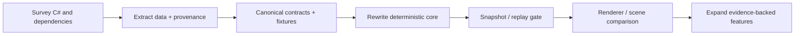

# Social Dev C# Rewrite Roadmap

## Principles

Social Dev work starts by extracting the data and responsibilities of the C# systems, then writing a clean-room, contract-first, behavior-faithful implementation. The new system preserves what the player can see — scenes, characters, movement, work, conversation, animation, and related events — without bringing the entire gameplay/management game into scope.

The current system survey is at `docs/reports/social-dev_csharp_system_survey.md`.

The Phase 0 execution details are at `docs/roadmap/Roadmap_SocialDev_Phase0_SystemExtraction.md`.

The Phase 1 execution details are at `docs/roadmap/Roadmap_SocialDev_Phase1_FirstSliceData.md`, and the first extraction result is at `docs/reports/social-dev_phase1_first_slice_data_report.md`.

The Phase 1B follow-up details are at `docs/roadmap/Roadmap_SocialDev_Phase1B_SceneBehavior.md`.

The Phase 1C follow-up details are at `docs/roadmap/Roadmap_SocialDev_Phase1C_SceneSemantics.md`, with the review result at `docs/reports/social-dev_phase1c_scene_semantics_report.md`.

Native semantics that supersede some blockers are at `docs/roadmap/Roadmap_SocialDev_Phase1D_NativeSemantics.md`, `docs/reports/social-dev_phase1d_native_semantics_report.md`, and `knowledge/fixtures/accepted/scene_native_semantics.json`.

## Web-application technology decision

The initial stack is **TypeScript + Vite + Canvas 2D + DOM/CSS**:

- `TypeScript` — catalog types, deterministic core, state machine, route service, event queue, and renderer adapter;
- `Vite` — dev server/build that converts TypeScript/ES modules to browser JavaScript;
- `Canvas 2D` — pixel-like scene, map, object, actor, and animation rendering with explicit draw-order control;
- `DOM/CSS` — panels, menus, text, bubbles, and debug/provenance UI;
- `Vitest` — contract, state-transition, route, and deterministic-replay checks;
- `Playwright` — added later for browser smoke and screenshot gates.

Do not use plain JavaScript as the primary source and do not use React in the simulation core: the core must be deterministic and should not depend on a UI framework. If a large management dashboard is needed later, add React/Preact only at the UI layer without changing the core.

Python remains valid for extraction/normalization tools outside the browser, but data promoted into the web application must become versioned JSON/typed catalogs. C# remains source evidence, not a runtime language.

## High-level sequence



Do not jump directly from A to F. A renderer without a state/data contract hides logic in the UI and makes game-fidelity verification impossible.

## Phase 0 — C# system extraction

### Goal

First answer: “Which C# systems must be rewritten to make the scene feel alive, and which systems are gameplay that can be cut?”

### Core to retain

1. `DataManager` → registry/data-loading contract;
2. `Room`, `RoomData`, `MapChip`, `Camera` → scene/grid/camera;
3. `ObjChip`, `FurnitureData` → object, occupancy, passability, interaction;
4. `Staff`, `StaffData`, `JobData`, `SkillData` → actor/living state;
5. `Astar`, `Node` → route/collision;
6. `Player` and `AppData` only for clock, room/actor ownership, and event/tick/presentation boundaries;
7. `DelayEvent`, `EventData`, `AvatarEventData`, `TalkData`, `EventMessageData`, `TodayEventData` → visible event/text;
8. `ScheduleData` → visible work/schedule behavior.

### Core to defer or cut

`Proposal`, `Develop`, `Company`, `GameRecord`, `Fan`, `Enemy`, `FestivalManager`, `Reinforce`, `Treasure`, shop/economy/recruitment/progression, and backend-like systems remain outside the core until a specific visible requirement exists.

### Outputs

- system inventory;
- dependency graph;
- keep/adapt/defer/cut matrix;
- source-slice manifest;
- unknown/conflict/quarantine review queue.

## Phase 1 — Extraction package

Extract source data into intermediate evidence without guessing a runtime model:

- data records and loader/column mappings;
- scene map, object placement, direction, footprint, passability, and camera;
- staff identity, spawn, animation selectors, and behavior fields;
- state/movement constants, transitions, timers, and arrival callbacks;
- route fixtures and goal flags;
- event opcode/term/text subsets that affect the displayed scene;
- asset-selector relationships and source hashes.

Every item must have provenance, status, input hash, and review note according to `Roadmap_SocialDev_Data_Readiness.md`.

## Phase 2 — Canonical contracts

Create contracts readable by runtime:

```text
SceneCatalog
ActorCatalog
ObjectCatalog
TextCatalog
BehaviorCatalog
TickOrderContract
AssetSelectorContract
```

Every record must have a stable ID not based only on array index and must be validatable without executing decompiled C#.

## Phase 3 — Deterministic core rewrite

Rewrite according to this dependency order:

```text
DataCatalog
  → WorldContext / Clock
  → Room / ObjectOccupancy
  → RouteService
  → StaffStateMachine
  → EventQueue / TextCatalog
  → Snapshot / Digest / Replay
```

Key rules:

- `DataCatalog` is the core's only data source;
- `WorldContext` owns world state; do not use an `AppData` singleton;
- `StaffStateMachine` does not read DOM/canvas;
- `RouteService` receives grid/occupancy through an interface;
- the renderer reads snapshots only;
- tick and random sources must be controllable for replay.

## Phase 4 — First display slice

Build one room, 3–5 actors, 2–3 object types, and one living loop:

`idle → move → arrive → work → talk → idle`

Pass both the behavior-trace and asset-selector gates before extending the scene renderer.

## Phase 5 — Renderer and visual parity

Connect camera, map/object/character layers, animation frames, bubbles, text, and viewport from a gated snapshot, then compare screenshots with the game.

## Phase 6 — Optional systems

Add avatar interaction, meetings, special events, or management only when contracts and tests/traces support them. Do not port a class merely because it exists in C#.

## Definition of ready

A phase is complete only when it has all of the following:

- a versioned contract;
- reversible evidence/provenance;
- a deterministic fixture/replay;
- a validation report;
- no raw C# or scaffold imported into runtime;
- unresolved items declared explicitly.

## Workspace layout

```text
knowledge/fixtures/accepted/   # survey, extraction, provenance, review queue
knowledge/sources/data/       # organized source copy/read-only analysis data
knowledge/fixtures/accepted/runtime/     # approved contracts and validation reports
runtime/social-dev/catalog/      # promoted normalized data
runtime/social-dev/core/         # rewritten simulation/living logic
runtime/social-dev/render/       # presentation adapter
docs/reports/                    # evidence-backed survey reports
docs/roadmap/                    # active execution roadmaps
```
