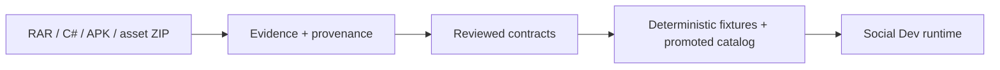

# Social Dev Data Readiness Roadmap

## Goal

Build data that is “runtime-ready” for displaying the original scene, characters, and living logic, with every value traceable to:

- its source;
- its data type, unit, default, and meaning;
- the scene/character/behavior part that consumes it;
- cross-checks against C#, the assembly guide, the asset index, and the APK;
- a fixture that makes the result repeatable.

Data that is not ready may remain in evidence, but must not silently flow into executable runtime.

## Data flow



## First data slice

Do not start with the entire game; build `display-slice-01` first:

- one verifiable room or floor;
- that scene's camera and coordinate transform;
- 3–5 original characters;
- 2–3 furniture/object types;
- at least one route;
- one living loop: `idle → move → work → talk`;
- the text or bubble displayed in that loop.

If a field or asset lacks sufficient evidence, use a renderer placeholder and retain the value as `unknown`/`quarantine` rather than guessing.

## Standard data statuses

| Status | In evidence | In runtime | Meaning |
|---|---:|---:|---|
| `verified` | yes | yes | Source and sufficient cross-evidence exist |
| `raw_only` | yes | no | Found in source, but semantic meaning is not verified |
| `derived` | yes | not by default | Newly calculated/inferred value requiring additional review |
| `unknown` | yes | no | Meaning cannot yet be identified |
| `conflict` | yes | no | Multiple evidence sets disagree |
| `quarantine` | yes | no | Decompiler/asset/loader issue requires separate review |

Every promoted field and asset must have `status`, `source_ref`, `evidence_refs`, `confidence`, `review_note`, and the hash of the input used to create it.

## Phase 0 — Extract C# systems before locking the slice

The first task is not renderer work or guess-based field selection. It is a C# system inventory that identifies the scene/character/living-logic core and the gameplay that can be cut.

Read and follow `Roadmap_SocialDev_CSharp_Rewrite.md` and `docs/reports/social-dev_csharp_system_survey.md` first, grouping at least:

- `DataManager` → data registry/loader contract;
- `Room`/`RoomData`/`MapChip`/`Camera` → scene/grid/camera;
- `ObjChip`/`FurnitureData` → object/occupancy/passability;
- `Staff`/`StaffData`/`JobData`/`SkillData` → actor/living state;
- `Astar`/`Node` → route/collision;
- `Player`/`AppData` → clock, world ownership, and event/tick boundary only;
- `DelayEvent`/`EventData`/`TalkData` and related data → visible event/text.

Do not port `Player`, `AppData`, `DataManager`, `Staff`, or `Astar` as whole files because some bodies are decompiler artifacts or combine responsibilities outside the display-runtime boundary.

### Outputs

- system inventory and dependency graph;
- keep/adapt/defer/cut matrix;
- source-slice manifest;
- review queue for `unknown`/`conflict`/`quarantine`.

### Gate

Before creating the canonical runtime model, state each system's owner, inputs, outputs, and consumers.

## Phase 0b — Lock the slice contract

### Work

- identify the room, characters, objects, and living loop to build first, using temporary fixture names until real names are verified;
- identify what must be displayed and what is cut, such as economy, progression, recruitment, win/loss, and backend;
- list only fields required for display.

### Outputs

- `knowledge/fixtures/accepted/runtime/display_slice_contract.json`;
- acceptance screenshot and behavior-trace list;
- in-scope and out-of-scope field/asset list.

### Gate

For every field, answer whether it is used to draw, move, change animation, display text, or drive an event. If not, it is not ready for runtime.

## Phase 1 — Inspect only the source paths used for display

### Primary source

- `data/DataManager.cs`, `RoomData.cs`, `StaffData.cs`, `FurnitureData.cs`, and data classes used by the slice;
- `game/Room.cs`, `Staff.cs`, `ObjChip.cs`, `Camera.cs`, and related actors;
- `game.routeSearch/Astar.cs` for route/collision;
- bounded lifecycle code from `main` only as required for tick and scene loading.

### Work

- use the RAR extraction as the provenance anchor;
- use the C# update only as a candidate revision after marker normalization;
- compare field declarations, loader assignments, access edges, assembly traces, and asset selectors;
- resolve loader mismatches in the review queue before creating a catalog.

The current inventory has `43` data registries, `44` data classes, and `1,112` fields; the load candidate has `38` matched classes, `3` count mismatches, and `3` missing loads. These are review counts, not ready-to-use data.

### Outputs

- `knowledge/fixtures/accepted/display_field_provenance.json`;
- source-slice notes pointing to files/lines;
- mismatch-resolution records for every loader in the slice.

### Gate

Do not create a production model from column order alone, and do not convert `raw_only` into a semantic name without additional evidence.

## Phase 2 — Create the canonical data contract

### Work

Convert decompiled/parallel-array data into typed records usable by runtime, for example:

- `SceneCatalog`: room, grid, camera, layers;
- `ActorCatalog`: identity, visual selector, spawn, animation profile;
- `ObjectCatalog`: selector, footprint, direction, interaction role;
- `TextCatalog`: key, language, fallback, bubble role;
- `BehaviorCatalog`: state, transition, timer, event, and provenance.

Do not add scaffold fields or fields without source provenance merely to make the schema appear complete.

### Outputs

- versioned JSON/TypeScript schema;
- catalog fixture for `display-slice-01`;
- canonical ID mapping not based only on array position.

### Gate

Every record must load, validate, have a stable ID, and trace back to source evidence.

## Phase 3 — Verify scene and assets

### Scene

Make `RoomData.objMap_`, `objDir_`, `floorImgId_`, `wallImgId_`, `doorImgId_`, object placement, coordinate transform, camera, and draw order one contract.

### Asset

Connect C# selectors to the assembly guide, ZIP `ASSET_INDEX`, pack map, and APK source entry, checking:

- identity;
- selector/relationship;
- dimensions and layer role;
- source hash and roundtrip;
- language/variant, if any.

ZIP/APK structural consistency is currently established, but selector promotion is still blocked. Do not copy an asset into runtime merely because its name or path looks correct.

### Outputs

- `knowledge/fixtures/accepted/scene_contract.json`;
- `knowledge/fixtures/accepted/asset_selector_contract.json`;
- `knowledge/fixtures/accepted/runtime/display_asset_manifest.json` for gated entries only;
- previews/contact sheets in evidence only.

## Phase 4 — Prepare living-logic data

### Work

Separate behavior that makes the scene feel alive from the gameplay that is cut:

**Keep:** spawn, idle, movement, route, arrival, facing, animation, work, talk, bubble, timer, visible event, and actor interaction.

**Cut first:** economy, progression, recruitment UI, resource management, win/loss, backend, auth, multiplayer, and LLM.

For each behavior, record:

- input state;
- transition condition;
- tick/order;
- output state;
- generated event/bubble;
- timer/random source;
- evidence and confidence level.

### Outputs

- `knowledge/fixtures/accepted/runtime/actor_behavior_contract.json`;
- `knowledge/fixtures/accepted/runtime/tick_order_contract.json`;
- deterministic trace such as `idle → move → arrive → work → talk`;
- route, collision, animation, and bubble-expiry fixtures.

### Gate

The original trace must replay from the same input, and the renderer must read the trace/snapshot without creating a second logic system in the UI.

## Phase 5 — Create the promoted runtime package

After Phases 1–4 pass, create a package separate from raw evidence:

```text
knowledge/fixtures/accepted/   # source facts, review queues, provenance
knowledge/sources/data/       # organized analysis copy
knowledge/fixtures/accepted/runtime/     # approved runtime contracts
runtime/social-dev/catalog/      # promoted display data
runtime/social-dev/core/         # runtime implementation
```

Every rebuild must include schema version, input hash, generated-at, source references, and a validation report.

## Phase 6 — Data-readiness gate

`display-slice-01` is ready when all of the following hold:

- every field read by runtime is `verified` or has an explicitly approved exception;
- every asset selector resolves without guessed paths;
- room/grid/camera/draw order are deterministic;
- the actor trace replays and the state digest matches;
- locale/text fallback passes;
- there is no import from raw C#, archive, or scaffold;
- scene screenshots pass the baseline and browser smoke has no errors;
- the report openly lists remaining unresolved items.

## Immediate next steps

1. Build `display_slice_contract` and select the first room/character fixture set.
2. Create the field matrix for `RoomData`, `StaffData`, `FurnitureData`, `Room`, `Staff`, `ObjChip`, and `Camera`.
3. Fix loader mismatches only for records used by the slice.
4. Build the first floor/object/character selector contract.
5. Trace one living loop and create a deterministic fixture.
6. Start writing the core and renderer only after the data gate passes.

## Do not do during data preparation

- Do not bulk-copy 44 C# classes into runtime.
- Do not port `Player`/`Staff`/`Astar` as whole files without separating the required behavior.
- Do not use an asset preview as a runtime asset before the selector gate.
- Do not let the UI compute state itself.
- Do not modify the RAR/APK/ZIP source or create generated JSON/PNG files at the workspace root.
