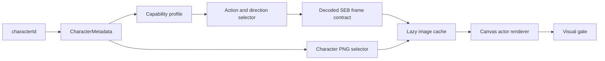

# Social Dev Full Character Asset Runtime Roadmap

## Objective

Close the gap between the full character metadata/capability catalog and the bounded `display_asset_manifest`. Every native human character image and native human animation selector must be available through one shared runtime path, while the browser keeps image loading lazy and the source archive remains read-only.

The completed scope is:

- `141` `StaffData` templates, including the named special range (`114–129`) and assistant-shaped rows (`130–140`), resolve through `human-staff-v1`.
- All `105` native human PNG selectors and all `35` native human SEB selectors are promoted byte-for-byte into the dedicated character asset namespace.
- All `35` SEBs are decoded into a multilayer frame contract, including the observed control/no-texture records.
- Every native SEB filename is callable through a shared filename-derived action map; missing directions remain explicit rather than being mirrored or invented.
- The renderer can draw a character outside the five-actor bounded display slice through the same metadata → capability → selector → frame path.

The scope does not silently convert `HelperData`, avatar body/head parts, or event-only entities into staff. Those are separate asset families and remain explicit future packages.

## Architecture and ownership



| Layer | Owner | Runtime responsibility | Loading policy |
| --- | --- | --- | --- |
| Static identity | `character_metadata_contract.json` | Names, source fields, relations, image selector, profile references | Imported as compact catalog data |
| Shared behavior/capability | `character_capability_contract.json` | Family profile, action aliases, native action inventory, fallback/deferred status | Imported once; no per-character animation copy |
| Physical character assets | `character_asset_manifest.json` | Exact PNG/SEB hashes, paths, image bindings, decoded frame records | PNG lazy by `asset_id`; full catalog is not eagerly decoded into images |
| Mutable life | `ActorState` and simulation | Position, route, lifecycle, facing, frame, interaction timing | Created only when an actor is spawned/displayed |
| Browser display | `character-assets.ts` and `canvas-renderer.ts` | Resolve active frame records and draw available pixels | Request/cache only the active character image |

The existing `display_asset_manifest.json` remains the approved bounded world/display-slice contract. The full character package is intentionally a separate `character_asset_manifest.json`; replacing the bounded manifest would mix two different evidence scopes.

## Execution plan and closure

### Phase 0 — Inventory and authority

1. Read the supplied asset ZIP and `ASSET_INDEX.json` without modifying the source root.
2. Cross-check `human/img.inf` and `human/seb.inf` against the runtime metadata and native content selector catalog.
3. Assert `105` image selectors and `35` animation selectors, including selector `100` (`head.seb`).
4. Preserve archive-relative members, selector IDs, source hashes, and unresolved/control statuses exactly.

Closure: `character_asset_fixture.json` records the source archive and selector-index hashes; the builder fails if any expected selector is missing or duplicated.

### Phase 1 — Exact asset promotion

1. Copy only the validated human PNG/SEB members into `runtime/social-dev/assets/character-catalog/01_GAME_PACKS/human/`.
2. Compare source and runtime SHA-256 values and byte lengths for every promoted file.
3. Store runtime paths in the manifest; the browser never opens the ZIP or source extraction roots.
4. Bind every `StaffData` record to its resolved human image selector. Special and assistant-shaped staff rows use the same profile and remain individually addressable.

Closure: `105` PNGs, `35` SEBs, `201347` promoted bytes, and exact source/runtime hashes.

### Phase 2 — Multilayer SEB frame decoder

The offline decoder handles the observed native format:

1. Parse the big-endian header: layer count, global frame count, record count, and frame bound.
2. Parse the first layer from the header record count.
3. Parse later layers from the four-byte layer marker and that layer's record count.
4. Decode records as `>HHHHhhhhHH` and retain layer index, record index, start frame, source rectangle, destination offset, flags, and reserved value.
5. Treat raw texture ID `65535` as native `-1` / `TEXID_NONE`; preserve it as `control_no_texture` and never map it to a PNG.
6. Validate drawable rectangles against the referenced `270×60` human PNG and use the global frame bound for frame normalization.
7. Select the latest record at or before the requested frame independently for each layer, then draw in layer order.

Runtime composition treats `image_id=0` as the current StaffData image slot. The decoded contract keeps its `chara00.png` source-slot reference for provenance, while the renderer substitutes the bound character image. Non-zero image IDs, such as `head.seb`'s image slot `1`, resolve to their own promoted asset and are loaded only when that frame is used.

Closure: `35` animations, `48` layers, `334` records, `30` explicit control records, and zero invalid drawable rectangles.

### Phase 3 — Shared action capability

1. Keep the existing semantic state actions: `wait`, `move`, `typing`, `talk`, and explicit fallback/deferred states.
2. Add `native_actions` generated from the authoritative SEB filename stems. The current inventory exposes `16` callable groups, including `walk`, `hug`, `goody`, `banzai`, `eieio`, `happy`, `furifuri`, `tornade`, `wow_tornade`, `head`, and the other native stems.
3. Preserve direction availability exactly. For example, `banzai` resolves `right` and `down`; asking for `left` returns `no_selector_for_direction`.
4. Resolve semantic aliases first, then native filename actions, then the decoded frame contract.
5. Keep unsupported semantic actions such as `fly_away` explicitly deferred until a native selector is evidenced.

Closure: all `35` native selectors are reachable through `human-staff-v1.native_actions`; no selector is silently remapped to a different direction.

### Phase 4 — Lazy runtime integration

1. Load the generated manifest through `RuntimeCatalogs` and validate its approved runtime-catalog status.
2. Add `character-assets.ts` as the only browser-facing full-character asset adapter.
3. Cache `HTMLImageElement` values by `asset_id`; deduplicate concurrent requests with a promise cache.
4. Preload an active actor's image only when the current bounded display asset is not already present.
5. Resolve each frame record's image slot independently: slot `0` maps to the active character image; other slots map to their promoted image asset.
6. Use decoded frame records from the manifest directly; do not parse SEB binaries in the browser.
7. Draw generic character frames when a source character is outside the bounded five-actor display binding; retain the existing marker fallback if metadata or pixels are unavailable.
8. Expose the same generic frame result to the visual gate so asset availability, frame bounds, drawable cards, and required assets remain observable.

Closure: `resolveCharacter`, `resolveCharacterAction`, `characterDisplayFrame`, and the Canvas renderer share the same catalog path, with no eager full-catalog image load.

### Phase 5 — Verification and handoff

The acceptance gate is:

```text
python tools/social-dev/build_character_capabilities.py
python tools/social-dev/build_character_asset_manifest.py
python tools/social-dev/test_character_capabilities.py
python tools/social-dev/test_character_asset_manifest.py
cd runtime/social-dev
npm run typecheck
npm test -- --run
npm run build
```

Required results are:

- capability validation `14/14`;
- asset validation `10/10`;
- metadata bindings `141` staff / `19` helpers;
- native selector coverage `35/35`;
- TypeScript typecheck, Vitest, and production build pass;
- source/runtime hashes remain exact;
- no source ZIP, APK, C#, or unapproved binary is imported by the browser runtime.

## Remaining boundaries

- `HelperData` remains a record/portrait/dialogue/effect family, not a staff lifecycle actor.
- Avatar body/head composition and event-only assets need their own source-backed packages before they can render as full animated families.
- `fly_away` remains deferred because the current native human selector inventory does not contain a distinct selector.
- The active simulation still spawns the bounded scene actors by design. Full-catalog readiness means any approved staff template can now be resolved and drawn when a future scene chooses to spawn it; it does not imply that all `141` actors appear simultaneously.
- A future browser smoke pass may promote a dedicated full-catalog showcase scene, but it is not required to make the catalog/runtime path complete.

## Artifacts

- `tools/social-dev/build_character_capabilities.py`
- `tools/social-dev/build_character_asset_manifest.py`
- `tools/social-dev/test_character_capabilities.py`
- `tools/social-dev/test_character_asset_manifest.py`
- `knowledge/fixtures/accepted/runtime/character_capability_contract.json`
- `knowledge/fixtures/accepted/runtime/character_asset_manifest.json`
- `runtime/social-dev/src/catalog/character-resolver.ts`
- `runtime/social-dev/src/assets/character-assets.ts`
- `runtime/social-dev/src/renderer/canvas-renderer.ts`
- `runtime/social-dev/src/renderer/visual-gate.ts`
