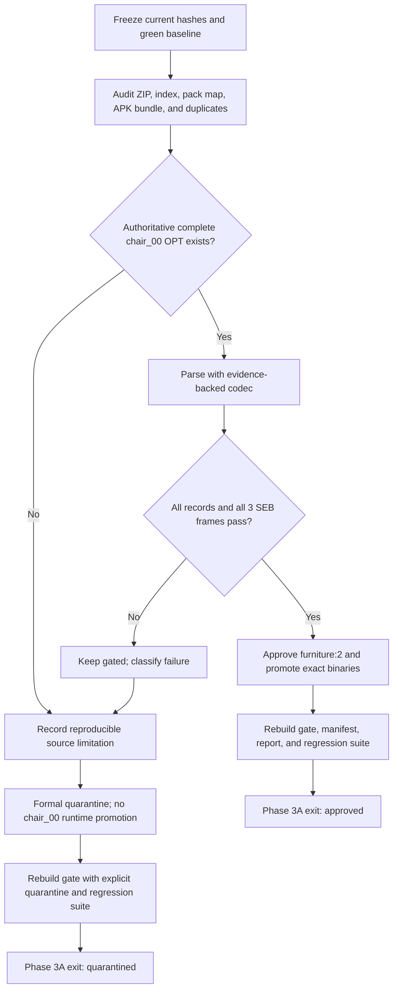

# Social Dev Phase 3A — Asset Composition Closure

## Purpose

Phase 3A closes the bounded `furniture:2` display composition for `display-slice-01`.
The composition is a `FurnitureData(2)` desk (`desk_00.seb`) with a `subSeb_`
chair (`chair_00.seb`). The exact source-backed reconstruction is now approved:
the first byte of each logical OPT cell is a piece count, so the `chair_00.opt`
payload is complete with cell pattern `[1, 2, 1]` and requires no invented bytes.

## Current outcome

- Phase 3A status: `approved`.
- `chair_00` logical reconstruction: `pass`, 180×32, pixel SHA-256
  `23d8e732fa2000f18f8fd9649b5fbe2b190d95aff86475b8befd09cfbe8afeef`.
- The former 14-byte “partial tail” is the second 14-byte crop descriptor in
  logical cell 1, not missing source data.
- Full-pack validation: `411/411` OPT payloads parse and consume exactly;
  `89/89` available derived logical references match pixel-for-pixel.
- `furniture:2` is promoted in the display manifest, while native room:0
  placement remains a separate boundary because no native FurnitureData(2)
  binding is evidenced.

Phase 3A has exactly two valid outcomes:

1. **Approved:** an authoritative, complete, source-supported `chair_00.opt`
   payload is recovered and all three chair frames pass the composition gate.
2. **Formally quarantined:** the authoritative source is demonstrably limited
   or truncated, the limitation is recorded with hashes and reproducible
   diagnostics, and `furniture:2` remains excluded from the runtime manifest.

The second outcome is retained as a contingency path only; it closes the
evidence question without visually approving `furniture:2`. The active outcome
is the first path, so Phase 3B/3C may consume the exact approved composition.

## Scope lock

### In scope

- `FurnitureData(2)` selector and source relationship closure.
- `chair_00.png` + `chair_00.opt` logical reconstruction.
- `chair_00.seb` frame rectangles and offsets.
- The existing `desk_00.seb` primary composition as a regression anchor.
- Deterministic display-gate and runtime-manifest promotion/quarantine.
- OPT codec diagnostics and focused regression fixtures.
- Provenance, hashes, state, TODO, and Phase 3A report updates.

### Out of scope

- Native room placement, floor/wall/door identity, camera, or draw order;
  those belong to Phase 3B.
- Canvas integration, screenshot comparison, and browser visual acceptance;
  those belong to Phase 3C.
- Any change to the original ZIP, APK, extracted source, C# files, or
  historical baseline screenshot.
- Replacing `chair_00` with `chair_02`, `chair_03`, `chair_04`, or any other
  visually similar asset.
- Padding, truncating, byte-shifting, rewriting, or hand-authoring the source
  `.opt` file.

## Current evidence baseline

| Evidence | Current fact | Consequence |
|---|---|---|
| `FurnitureData(2)` | Name `Desk`, type `2`; `seb_` id `1` → `desk_00.seb`; `subSeb_` id `3` → `chair_00.seb`; `img_` id `3` → `desk_00.png` | Selector identity is already resolved; composition is not closed. |
| `chair_00.seb` | 68 bytes; one layer; 3 global frames; 3 records; frame bound 3; all records use `image_id=4` | The sub-composition requires three 60×32 source rectangles. |
| Chair frame 0 | Source `(60,0,60,32)` at destination `(0,-15)` | Requires a 180×32 logical source. |
| Chair frame 1 | Source `(0,0,60,32)` at destination `(-20,-11)` | Requires a 180×32 logical source. |
| Chair frame 2 | Source `(120,0,60,32)` at destination `(-20,-11)` | Requires the third logical cell; this is not optional. |
| `chair_00.png` | 34×15; SHA-256 `234d25900ecff341a6ee9385a691ddc633c41a3f0c6d917080839a9e5d571efc` | Raw PNG cannot satisfy any 60×32 SEB frame directly. |
| `chair_00.opt` | 63 bytes; SHA-256 `5cf124773282b1693210853c6fb04a35426a55d04b08cccb61daa4b8f7454f0a`; header `60×32`, `3×1`; variable-piece cells `[1,2,1]` | The payload consumes exactly and reconstructs all three logical cells from `chair_00.png`. |
| Variable-piece parse | Cell 0 has one crop, cell 1 is a two-crop composite, and cell 2 has one crop; all four rectangles fit the 34×15 PNG | The former fixed-15-byte record parser misclassified the second cell piece as a 14-byte tail. |
| Derived references | The source package contains derived logical images for `chair_02`, but no `chair_00.logical.png` | A related chair is useful only as a format regression anchor, never as a replacement or expected image. |
| Current display gate | 14 entries; 12 approved; 2 blocked for room coordinate composition; 22 promoted binaries; `furniture:2` is approved | The exact chair source is now inside the approved display boundary. |
| Current runtime manifest | Contains `furniture:0`, `furniture:1`, `furniture:2`, and `furniture:5`, including exact `chair_00` source binaries | Native room placement remains separate from display-asset approval. |
| APK loader-path re-extraction | The pinned APK `chip` TextAsset yields `chair_00`–`chair_04` PNG/OPT/SEB triplets through the four-byte output-length prefix; all 15 outputs match the supplied ZIP byte-for-byte | APK recovery confirms the exact source bytes; the validated variable-piece grammar makes an alternate payload unnecessary. |
| Three-version APK comparison | The supplied `2.4.9`, `2.5.0`, and `2.5.1` APKs decrypt to the same 333-entry chip pack and the same 15 selected chair outputs | The `chair_00`/`chair_01` limitation spans all supplied builds; version-specific extraction or container loss is ruled out. |

The source ZIP, assembly-guide index, pack-source map, and APK metadata are
provenance inputs. They are read-only. The assembly guide is an operational
description of the relationship `img.inf → PNG → optional OPT → SEB`; it is not
authority to repair a damaged payload.

## Non-negotiable invariants

1. The source archive and APK hashes remain unchanged.
2. Every source byte used for approval is traceable to an indexed source member
   and its SHA-256.
3. A valid OPT payload must satisfy the declared logical grid, variable
   per-cell piece counts, source bounds, and exact EOF consumption. A partial
   or ambiguous payload is not a pass.
4. All three `chair_00.seb` records must pass against the reconstructed logical
   source. Passing only frames 0 and 1 is insufficient.
5. A related asset may prove a shared format rule, but it cannot supply missing
   `chair_00` bytes, pixels, selectors, or expected output.
6. Derived preview PNGs are evidence only. They are never copied into the
   browser runtime as original assets.
7. The browser runtime consumes only `knowledge/fixtures/accepted/runtime/display_asset_manifest.json`
   and binaries under `runtime/social-dev/assets/display-slice-01/`.
8. If no authoritative recovery exists, quarantine is the successful closure
   path; speculative reconstruction is not. When the original bytes pass the
   validated variable-piece grammar, promote those original bytes directly.

## Decision flow



## Work packages

### 3A-0 — Freeze and record the baseline

Before editing code or generated evidence:

1. Run the current gates from the workspace root:

   ```text
   python tools/social-dev/test_opt_codec.py
   python tools/social-dev/test_display_asset_gate.py
   ```

2. Run the runtime regression checks from `runtime/social-dev/`:

   ```text
   npm run test -- --run
   npm run build
   ```

3. Record the current gate hash, manifest hash, source archive hash, and APK
   hash in the Phase 3A closure artifact. The active approval shape is
   `approved=12`, `blocked=2`, and `promoted_binary_assets=22`.
4. Confirm that the exact source-backed `chair_00.png/.opt/.seb` triplet exists
   under the runtime asset boundary.
5. Do not start a development server; Phase 3A is a file/codec/gate task and
   does not need a long-running process.

**Exit check:** the baseline is green and the source/runtime boundaries are
explicit before any implementation change.

### 3A-1 — Perform a bounded source/provenance audit

Create a deterministic audit step, preferably as
`tools/social-dev/build_phase3a_asset_composition.py`, that reads but never
modifies the source inputs. The audit must:

1. Verify the asset ZIP SHA-256 against the existing inventory and confirm that
   the ZIP `ASSET_INDEX.json` matches the extracted index.
2. Resolve and hash these exact source members:

   ```text
   01_GAME_PACKS/chip/chair_00.png
   01_GAME_PACKS/chip/chair_00.opt
   01_GAME_PACKS/chip/chair_00.seb
   01_GAME_PACKS/chip/desk_00.png
   01_GAME_PACKS/chip/desk_00.opt
   01_GAME_PACKS/chip/desk_00.seb
   01_GAME_PACKS/chip/img.inf
   01_GAME_PACKS/chip/seb.inf
   01_GAME_PACKS/xls/English.lproj/furniture.txt
   01_GAME_PACKS/xls/Japanese.lproj/furniture.txt
   ```

3. Confirm the selector chain independently from the canonical selector
   contract and both locale rows. The English/Japanese rows may be compared,
   but source-derived labels must remain exact.
4. Confirm `image_id=4` in `chip/img.inf` and `seb id=3` in `chip/seb.inf`.
5. Search the complete source ZIP for duplicate or alternate `chair_00.opt`,
   `chair_00.png`, and `chair_00.seb` members. Record `duplicate_count` and
   all matching paths rather than assuming uniqueness.
6. Inspect the APK source entry named by the asset index. If it is an asset
   bundle, record the bundle hash and the fact that it is not itself a second
   filename-level OPT source. Follow the native `JarInflater` path: resolve the
   encrypted `chip` TextAsset, read the pack tables, skip the four-byte output
   length prefix for each selected entry, and compare the returned bytes with
   the indexed ZIP member. An exact output may be used as a provenance
   cross-check only; it must not be treated as a repaired source when it is
   byte-identical to the existing member.
7. Check the pack-source map roundtrip status for `chip` and retain the
   existing asset inventory reference.
8. Inspect related chip OPTs (`chair_02`, `chair_03`, `chair_04`, `desk_00`,
   and `door_02`) only to establish a format comparison set. Record their
   headers, lengths, record counts, and statuses; do not copy their payloads.

The audit output should include:

```json
{
  "schema_version": "social-dev-phase3a-source-audit-v1",
  "status": "pass|source_limited|conflict",
  "target": "furniture:2",
  "source_members": [],
  "selector_chain": {},
  "apk_source": {},
  "duplicates": {},
  "comparison_set": [],
  "findings": [],
  "determinism": {"algorithm": "stable-json-sha256", "content_hash": "..."}
}
```

**Exit check:** every recovery candidate is either authoritative and hash-backed
or explicitly rejected. No “best-looking” candidate may remain implicit.

### 3A-2 — Diagnose the OPT payload without changing its bytes

Extend `tools/social-dev/opt_codec.py` only if the audit identifies an
evidence-backed parser issue. The diagnostic model should distinguish:

- declared logical grid and expected record count;
- physically complete 15-byte record spans;
- trailing/partial bytes;
- record field values and byte offsets;
- source-rectangle bounds;
- reconstruction status (`pass`, `candidate`, or `blocked`);
- explicit anomaly codes.

The current floor-division behavior must not turn arbitrary 15-byte chunks into
an apparently valid record. A parser change is acceptable only if:

1. the existing valid fixtures remain byte/pixel identical for `desk_00`,
   `chair_02`, and `door_02`;
2. the change is explained by the common format evidence from the comparison
   set or the assembly guide; and
3. `chair_00` either becomes fully valid under the same rule or remains
   explicitly blocked with a more precise diagnostic.

Run diagnostics against the raw bytes and retain the raw hash. Do not make a
candidate pass by ignoring a malformed record, dropping bytes, padding a
record, changing endianness without evidence, or shifting the record boundary
until the pixels look plausible. The complete-pack evidence establishes that
the byte after each logical cell is a piece count, followed by 14-byte crop
descriptors.

**Required focused fixtures:**

- valid two-record `desk_00.opt`;
- valid three-record `chair_02.opt`;
- valid one-record `door_02.opt`;
- truncated-header synthetic bytes;
- variable-piece cells with piece counts `0`, `1`, and `2`;
- the exact current `chair_00.opt` bytes, whose cell pattern is `[1,2,1]`.

**Exit check:** the codec can explain the malformed payload deterministically,
and all previous valid codec tests remain green.

### 3A-3 — Determine whether recovery is actually possible

Recovery is allowed only through one of these evidence paths:

1. An alternate exact `chair_00.opt` source member is found in the supplied
   source set and its hash/relationship is authoritative.
2. The APK contains an independently extractable exact OPT payload that
   byte-matches the intended source and can be linked to `chair_00` without
   guessing.
3. A general, already-proven OPT rule explains the apparent truncation and
   complete-pack/derived-reference validation confirms every reconstructed
   pixel and all three SEB frame rectangles. This is the path that closed
   `chair_00`: the variable-piece grammar matches `411/411` OPT payloads and
   `89/89` available derived logical references.

The following are not recovery evidence:

- copying bytes from `chair_02.opt` or another chair;
- using a related derived preview as the missing expected image;
- padding the file to the declared length;
- treating zero-filled or guessed bytes as source data;
- accepting only the frames that happen to fit;
- declaring success because the logical canvas is `180×32`.

Set a finite stop condition after the ZIP/index/APK loader/assembly-guide/
selector audit and comparison-set checks. The selected APK probe recovered all
15 chair triplet outputs exactly. The additional `2.4.9` and `2.5.0` APKs
reproduce the same 333-entry chip pack and the same chair triplets as `2.5.1`.
The exact source bytes are sufficient under the validated variable-piece rule;
no alternate payload is required.

**Exit check:** the closure artifact says `approved` with the exact source
reference and the reconstruction audit, or `source_limited` with a specific,
reproducible reason.

### 3A-4A — Recovery implementation path

Execute this path only if 3A-3 finds authoritative recovery evidence.

1. Update the codec or source loader to consume the recovered payload using the
   general evidence-backed rule.
2. Reconstruct the logical chair atlas. Expected dimensions from the current
   header are `180×32`.
3. Validate the three `chair_00.seb` records against the logical source:

   | Frame | Source rectangle | Destination |
   |---:|---|---|
   | 0 | `(60,0,60,32)` | `(0,-15)` |
   | 1 | `(0,0,60,32)` | `(-20,-11)` |
   | 2 | `(120,0,60,32)` | `(-20,-11)` |

4. Require `source_status=pass_opt_logical` for all three sub-composition
   records and no composition issues.
5. Verify the main `desk_00` composition again; Phase 3A must not regress the
   already-approved primary half of `furniture:2`.
6. Add an independent pixel fixture when one is available from the recovered
   source evidence. Store generated evidence only under
   `knowledge/fixtures/accepted/`; do not copy a derived logical PNG into
   runtime.

**Exit check:** the recovered `furniture:2` composition has complete selector,
PNG, OPT, SEB, source-rectangle, logical-size, pixel, and hash provenance.

### 3A-4B — Formal quarantine path

Execute this path when recovery cannot be proved.

1. Keep the original `chair_00.opt` in the read-only source archive and do not
   create a repaired replacement.
2. Write a closure record with:

   - target `furniture:2`;
   - selector chain and source member hashes;
   - raw size 63 bytes;
   - header `60×32`, `3×1`, expected record count 3;
   - `partial_tail_bytes=14`;
   - all reproducible anomaly codes and out-of-bounds values;
   - all recovery sources checked and why they were insufficient;
   - `status=quarantined_source_limitation`;
   - `runtime_policy=do_not_promote`.

3. Keep `furniture:2` out of the runtime manifest and ensure no `chair_00.*`
   binaries appear below `runtime/social-dev/assets/display-slice-01/`.
4. Replace the generic blocked reason with a stable source-limitation reason
   linked to the closure artifact. Do not call the entry approved.
5. Preserve the historical display screenshot and behavior trace unchanged.

**Exit check:** the blocker is no longer an open investigation item; it is a
closed, reproducible source limitation with an explicit runtime boundary.

### 3A-5 — Rebuild the display gate and manifest deterministically

Update `tools/social-dev/build_display_asset_gate.py` so `furniture:2` is
handled by the same data-driven path as the other selected furniture records.
Remove the unconditional `else` branch that always blocks id `2`; the result
must depend on the validated sub-composition and the Phase 3A closure status.

#### Approval outcome

Expected shape, subject to the builder's deterministic entry count:

- `furniture:2` entry: `approved_for_runtime_subset`;
- all three chair records: `pass_opt_logical`;
- manifest objects: `furniture:0`, `furniture:1`, `furniture:2`, `furniture:5`;
- new promoted binaries: `chair_00.png`, `chair_00.opt`, `chair_00.seb`;
- total promoted binaries is `22` after the exact chair triplet is added;
- no floor/wall/door placement status changes;
- gate remains partial because Phase 3B is separate.

#### Quarantine outcome

- `furniture:2` remains absent from the runtime `objects` map;
- no `chair_00` binary is promoted;
- the gate entry carries a stable quarantine/source-limitation status and
  closure reference;
- the remaining approved subset and all existing hashes are unchanged;
- the gate remains partial with the original runtime-safe behavior.

Add or update a deterministic closure artifact, for example
`knowledge/fixtures/accepted/phase3a_asset_composition_closure.json`, with
stable content hashing that excludes timestamps. It should reference the gate
hash and manifest hash after the outcome is rebuilt.

Update the report at
`docs/reports/social-dev_phase3a_asset_composition_report.md` with the outcome,
source matrix, exact hashes, checks, and explicit next-phase boundary.

**Exit check:** rebuilding twice from the same inputs produces identical
content after dynamic timestamps are removed, and runtime promotion contains no
unapproved source.

### 3A-6 — Regression and boundary verification

Run all of the following after the chosen outcome is implemented:

```text
# Workspace root
python tools/social-dev/test_opt_codec.py
python tools/social-dev/test_display_asset_gate.py
python tools/social-dev/test_object_catalog.py
python tools/social-dev/test_scene_catalog.py
python tools/social-dev/test_actor_catalog.py
python tools/social-dev/test_phase2c_readiness.py
python tools/social-dev/test_pre_runtime_closure.py

# runtime/social-dev/
npm run test -- --run
npm run build
```

Add a dedicated `tools/social-dev/test_phase3a_asset_composition.py` for the
closure artifact and outcome-specific assertions. Also update
`runtime/social-dev/tests/display-assets.test.ts`:

- approval path: expect 22 promoted assets and the four furniture object keys;
- quarantine path: assert that `furniture:2` is absent and the runtime policy
  still rejects unapproved assets.

The test must also assert:

- no `.cs`, APK, archive, or source ZIP is imported by the runtime;
- exact `chair_00` source binaries are present in runtime assets for approval;
- every manifest asset hash matches its promoted file for approval;
- gate and manifest rebuilds match their checked-in JSON after removing dynamic
  fields;
- `desk_00`, `chair_02`, and `door_02` pixel hashes remain unchanged;
- the historical screenshot and behavior trace hashes remain unchanged.

**Exit check:** all Python and TypeScript gates are green together; a failed
check is fixed before Phase 3A is reported complete.

### 3A-7 — Handoff and state synchronization

Only after 3A-6 passes:

1. Update `PROJECT_STATE.md` with the outcome, closure artifact, report,
   changed files, hashes, and the Phase 3B next step.
2. Mark the implementation TODO for Phase 3A complete only if either approval
   or formal quarantine is actually recorded. Do not mark it complete merely
   because the investigation was attempted.
3. Keep the main display-runtime roadmap synchronized with this detailed plan.
4. State clearly whether Phase 3C may render `furniture:2`:
   - yes only for the approval outcome;
   - no for the quarantine outcome.
5. Record that the historical screenshot baseline was not replaced by Phase
   3A.

## Acceptance checklist

### Common gates

- [x] Source ZIP/APK/index hashes are unchanged and recorded.
- [x] Selector chain for `FurnitureData(2)` is verified from canonical evidence.
- [x] `chair_00.seb` has all three records parsed and accounted for.
- [x] `chair_00.opt` has a deterministic variable-piece status and crop-map report.
- [x] No guessed, padded, borrowed, or rewritten source bytes exist.
- [x] Existing OPT pixel fixtures and display subset remain green.
- [x] TypeScript tests and production build pass.
- [x] Historical screenshot/behavior evidence is unchanged.

### Approval-only gates

- [x] Complete authoritative OPT payload is identified and hash-backed.
- [x] Logical atlas is `180×32` and independently fixture-checked.
- [x] All chair SEB records are `pass_opt_logical`.
- [x] `furniture:2` is present in the runtime manifest.
- [x] Exactly the source binaries justified by the manifest are promoted.

### Quarantine-only gates

- [ ] No authoritative recovery source remains after the bounded audit.
- [ ] Closure artifact says `quarantined_source_limitation`.
- [ ] The 63-byte source, 14-byte tail, and anomaly details are recorded.
- [ ] `furniture:2` and all `chair_00.*` binaries remain gated out of runtime.
- [ ] The gate exposes the limitation without treating it as an open blocker.

## Phase 3A exit statement template

```text
Phase 3A outcome: approved | quarantined_source_limitation
Target: furniture:2 / chair_00
Source audit: <path and content hash>
Closure artifact: <path and content hash>
Gate hash: <hash>
Manifest hash: <hash>
OPT result: <status, logical size, anomaly summary>
Runtime promotion: <approved binaries or none>
Regression result: <passed checks>
Phase 3C may render furniture:2: yes | no
Historical baseline changed: no
```

## Concrete file map

### Existing files to inspect or update

- `tools/social-dev/opt_codec.py`
- `tools/social-dev/test_opt_codec.py`
- `tools/social-dev/build_display_asset_gate.py`
- `tools/social-dev/test_display_asset_gate.py`
- `runtime/social-dev/src/assets/display-assets.ts`
- `runtime/social-dev/tests/display-assets.test.ts`
- `knowledge/fixtures/accepted/display_asset_gate.json`
- `knowledge/fixtures/accepted/runtime/display_asset_manifest.json`
- `docs/reports/social-dev_display_asset_gate.md`
- `PROJECT_STATE.md`
- `TODO.md`

### New Phase 3A artifacts

- `tools/social-dev/build_phase3a_asset_composition.py`
- `tools/social-dev/test_phase3a_asset_composition.py`
- `knowledge/fixtures/accepted/phase3a_asset_composition_source_audit.json`
- `knowledge/fixtures/accepted/phase3a_asset_composition_closure.json`
- `docs/reports/social-dev_phase3a_asset_composition_report.md`

Generated logical previews, if independently justified, belong under
`knowledge/fixtures/accepted/` and must be labelled derived. They must not be
placed at the repository root or promoted as original runtime assets.
